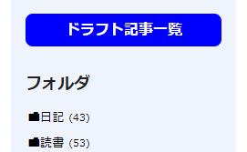

やりたいこと
----

Hugo では、作成途中の記事ページを[ドラフトとしてマークしておく](./draft.html)と、デフォルトで非公開になるので、気軽に記事を書き始めることができます。
ただ、ドラフトページがたくさん溜まってくると、自分が中途半端に書き始めた記事が散らばって分かりにくくなってしまいます。
そこで、ここでは下記のようなことを実現して、Hugo のドラフト機能をより便利に使用できるようにします。

{: .center }

* ドラフトの一覧ページに飛ぶための「ドラフト」ボタンをサイドバー上に表示する（上図）
* ドラフトの一覧ページでは、最終更新日やタグ情報も一緒に表示する
* 上記はローカルで作業中 (`hugo server`) のときのみ表示することとする


ドラフト記事一覧のページにジャンプするボタンを配置する
----

ドラフトページへジャンプするためのボタンは、レイアウトファイルから簡単に配置できるように、パーシャルファイルとして作成します。
個人的に、ローカルでしか有効にしないコードは、下記のように `debug` ディレクトリの下に入れるようにしています。
そして、全体のコードを `if .Site.IsServer` の条件で囲むことで、ローカルサーバーで起動しているときのみ出力されるようにしています。

#### layouts/partials/debug/draft-button.html

```
{{ "{{" }}- if .Site.IsServer -}}
<style>
  .xDraftButton {
    display: block;
    text-align: center;
    width: 100%;
    font-weight: bolder;
    color: white !important;
    background: blue;
    padding: 0.3em 0.5em;
    border-radius: 0.5em;
  }
</style>
<a href="/drafts/" class="xDraftButton">ドラフト記事一覧</a>
{{ "{{" }}- end }}
```

簡単に言えば、このパーシャルは、`https://example.com/drafts/` といった URL へのリンクを出力しているだけです。
上記では `style` 要素も含めてしまっていますが、みなさんはちゃんと CSS ファイルでスタイル定義するようにしてください。

このパーシャルファイルを、サイドバーを出力するテンプレートから呼び出します。

#### layouts/partials/sidebar/all.html（抜粋）

```
{{ "{{" }} partial "debug/draft-button" . }}
```


ドラフト記事一覧を表示するページを作成する
----

ドラフト記事をリストアップするためのショートコードを作成します。
下記のようにすれば、フロントマター部分に `draft: true` と記述された記事のみをループ処理できます。

#### layouts/shortcodes/list-drafts.html

```
<ul>
{{ "{{" }}- range (where .Site.Pages ".Draft" true) }}
  <li>
    <a href="{{ "{{" }} .RelPermalink }}">{{ "{{" }} .Title }}</a>
    <small>
      ({{ "{{" }} .Lastmod.Format "2006-01-02" }})
      {{ "{{" }} range .Params.tags }}#{{ "{{" }} . }} {{ "{{" }} end }}
    </small>
  </li>
{{ "{{" }}- end }}
</ul>
```

このショートコードを、ドラフト記事一覧のページを生成するための Markdown ファイルから呼び出します。
「ドラフト」ボタンのリンク先 URL を `/drafts/` にしたので、その URL に合うように、`drafts/_index.md` というパスに作成します。

#### content/drafts/_index.md

```
---
title: "ドラフト記事一覧"
draft: true
---

（ここに本文を書くこともできるよ！）

{{ "{{" }}% list-drafts %}}
```

これで、`hugo server -D` とサーバーモードで起動したときに、ドラフト記事一覧へのリンクボタンが表示されるようになり、簡単に書きかけの記事を確認できるようになります。

