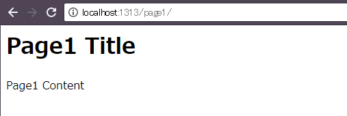

独自テーマの新規作成
----

Hugo には、ネット上に公開されているテンプレートがたくさんありますが、思い通りのデザインをするときは、自分でテーマを作成することになります。
テーマを作成するときは、まずは下記のコマンドで雛形を出力します。

~~~
$ hugo new theme ＜テーマ名＞
~~~

例えば下記のように実行すると、`themes/my-theme` ディレクトリが生成されます。

~~~
$ hugo new theme my-theme
~~~

生成されるファイル群は下記のようになっていて、ディレクトリ構成はバッチシできていますが、ファイル内の記述はほとんど空っぽです。
このファイル群をベースにして、テンプレートを作成していきます。

~~~
themes/my-theme/
   ├── LICENSE.md（MIT ライセンス）
   ├── archetypes/
   │   └── default.md（ほぼ空っぽ）
   ├── layouts/
   │   ├── 404.html（空っぽ）
   │   ├── _default/
   │   │   ├── list.html（空っぽ）
   │   │   └── single.html（空っぽ）
   │   ├── index.html（空っぽ）
   │   └── partials/
   │       ├── footer.html（空っぽ）
   │       └── header.html（空っぽ）
   ├── static/
   │   ├── css/
   │   └── js/
   └── theme.toml（デフォルトの設定ファイル）
~~~

トップページのレイアウト (layouts/index.html) を作成する
----

{: .center}

テーマディレクトリ内の `layouts/index.html` は、サイトのトップページ用のテンプレートファイルです。
もし、ひとつの HTML ファイルだけで構成されるサイト (SPA: Single Page Application) を作成するのであれば、このファイルだけを作成すればよいことになります。
初期状態では何も記述されていないので、まずは手始めに、サイト名だけを表示するように修正してみましょう。

#### themes/my-theme/layouts/index.html

~~~ html
<h1>{{ "{{" }} .Site.Title }}</h1>
~~~

上記のようにすると、サイト情報を保持する `.Site` 変数の、`Title` フィールドの値を出力することができます。
ここには、サイトの設定ファイル (`config.toml`) の `title` に設定した値が展開されます。

ここまで作成したら、このテーマを使ってサイトを表示してみましょう。

~~~
$ hugo server -t my-theme
~~~

とサーバを立ち上げたら、[http://localhost:1313/](http://localhost:1313/) にアクセスすれば、表示を確認できます。

トップページに全ページのリストを表示する
----

{: .center}

トップページのテンプレート (`layouts/index.html`) 内で、`.Data.Pages` 変数を参照すると、すべてのページの情報 ([Page 変数](https://gohugo.io/variables/page/)) を取得することができます。
この情報を `range` を使ってループ処理すれば、すべてのページへのリンクタグを出力することができます。

#### themes/my-theme/layouts/index.html

~~~ html
<h1>{{ "{{" }} .Site.Title }}</h1>
<ul>
  {{ "{{" }} range .Data.Pages }}
    <li><a href="{{ "{{" }} .RelPermalink }}">{{ "{{" }} .Title }}</a> ({{ "{{" }} .Date.Format "2006-01-02" }})
  {{ "{{" }} end }}
</ul>
~~~

各ページ用のレイアウトを作成する (layouts/_default/single.html)
----

リンク先の各ページは、`layouts/_default/single.html` テンプレートファイルを元に生成されるので、このファイルもあらかじめ作成しておく必要があります。
このテンプレートの中では、[Page 変数](https://gohugo.io/variables/page/) のフィールド（例えば `.Title`）を参照することができます。

#### themes/my-theme/layouts/_default/single.html

~~~ html
<h1>{{ "{{" }} .Title }}</h1>
{{ "{{" }} .Content }}
~~~

各ページの内容は、`content/` ディレクトリ内に下記のような感じで作成しておきます。

#### content/page1.md

~~~ md
---
title: "Page1 Title"
date: 2017-09-10
---

Page1 Content
~~~

上記のようにレイアウトとコンテンツを作成しておけば、各ページの内容が下記のように表示されるはずです。

{: .center}

