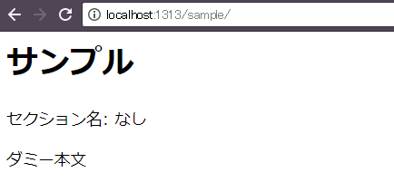
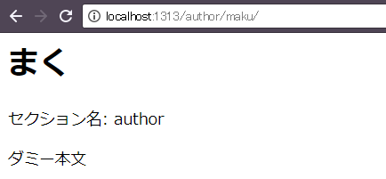
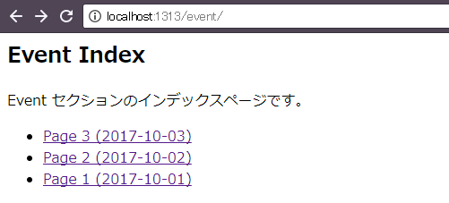

セクションの基本
----

Hugo の記事ファイル（`.md` ファイル）は、`content/` ディレクトリに格納していきますが、`content/` ディレクトリの下にさらにディレクトリを作成して、そこに格納することもできます。
例えば、下記の例では、`author/` ディレクトリをさらに作成して、その下に `.md` ファイルを格納しています。

~~~
/content/author/maku.md
~~~

このようなディレクトリ階層を作成すると、`maku.md` という記事は、`author` という**セクションに所属する**記事として扱われるようになります。
セクションはディレクトリ階層で表現されるため、１つの記事は、１つのセクションにしか所属できません。

セクション名は、記事のテンプレート内から `{{ "{{" }} .Section }}` で参照することができます。
個々の記事のレイアウトは、`single.html` ([single page template](https://gohugo.io/templates/single-page-templates/)) というテンプレートファイルによって行われるため、まずはこのテンプレートファイルを作成しましょう。

#### layouts/_default/single.html（トップ階層の layouts か、各テーマの layouts ディレクトリに配置する）

~~~ html
<h1>{{ "{{" }} .Title }}</h1>

セクション名: {{ "{{" }} with .Section }}{{ "{{" }} . }}{{ "{{" }} else }}なし{{ "{{" }} end }}

<main>
{{ "{{" }} .Content }}
</main>
~~~

ここで使用している <code>with</code> という構文は、<code>if</code> の拡張構文です。
<code>.Section</code> が存在する場合だけその値を表示し、存在しない場合は「なし」と表示するようにしています。

サンプルとして、下記のような２つの記事ファイルを用意します。

#### content/sample.md（どのセクションにも所属しない記事）

~~~ md
---
title: サンプル
date: 2017-10-04
---

ダミー本文
~~~

#### content/author/maku.md（author セクションに所属する記事）

~~~ md
---
title: まく
date: 2017-10-04
---

ダミー本文
~~~

それぞれのページにアクセスすると、下記のように表示されます。

{: .center }

{: .center }

`author/` ディレクトリ以下に配置した記事だけ、セクション名を取得できていることがわかります。

セクションの index ページを作成する
----

セクションの index ページ（**section page** と呼ぶ）は、`_index.md` というファイル名で作成します。
例えば、下記は `event` セクションに属するコンテンツの構成を示しています。

#### event セクションの記事

~~~
/content/event/_index.md  (section page)
/content/event/page1.md   (single page)
/content/event/page2.md   (single page)
/content/event/page3.md   (single page)
~~~

上記の index ページには、`http://localhost:1313/event/` というアドレスでアクセスできるようになります。
セクションの index ページがレンダリングされるとき、レイアウトファイルとしては `section.html` ([section page template](https://gohugo.io/templates/section-templates/)) 、あるいは `list.html` ([list page template](https://gohugo.io/templates/lists/)) が使用されます。
個々の記事ファイルをレンダリングするときに使用される `single.html` ([single page template](https://gohugo.io/templates/single-page-templates/)) とは異なるレイアウトファイルが使用されることに注意してください。
これはつまり、index ページがセクション内のコンテンツを一覧表示するためのリストページとして特殊扱いされることを意味しています。
より具体的には、下記のファイルのうち、最初に見つかったレイアウトファイルが `_index.md` のレンダリングに使用されます。

#### セクションの index ページ用のレイアウトファイル（[Section Page Templates](https://gohugo.io/templates/section-templates/) より抜粋）

~~~
/layouts/section/<SECTION>.html
/layouts/<SECTION>/list.html
/layouts/_default/section.html
/layouts/_default/list.html
/themes/<THEME>/layouts/section/<SECTION>.html
/themes/<THEME>/layouts/<SECTION>/list.html
/themes/<THEME>/layouts/_default/section.html
/themes/<THEME>/layouts/_default/list.html
~~~

<code>/layouts/_default/list.html</code> は、ホームページ（ルートの <code>_index.html</code>）や、タクソノミーリスト（あるタグがついたページの一覧）などのレイアウトファイルとしても使用されます。
ホームページ専用のレイアウトファイル、タクソノミーリスト専用のレイアウトファイルを用意したい場合は、<code>/layouts/index.html</code>、<code>/layouts/_default/taxonomy.html</code> などを作成します。これらの詳細は、Hugo マニュアルの <a href="https://gohugo.io/templates/homepage/">Homepage Template</a>、<a href="https://gohugo.io/templates/taxonomy-templates/">Taxonomy Templates</a>を参照してください。

ここでは、`/layouts/_default/list.html` というファイルとしてレイアウトファイルを作成してみます（`list.html` は、ホームページやタクソノミーリストのページにも使用される、リスト系ページ用の汎用レイアウトファイルです）。

#### /layouts/_default/list.html

~~~ html
<main>
  <article>
    <header>
      <h1>{{ "{{" }} .Title }}</h1>
    </header>
    {{ "{{" }} .Content }}
  </article>
  <ul>
    {{ "{{" }} range .Data.Pages }}
    <li>
      <a href="{{ "{{" }} .Permalink }}">{{ "{{" }} .Title }} ({{ "{{" }} .Date.Format "2006-01-02" }})</a>
    </li>
    {{ "{{" }} end }}
  </ul>
</main>
~~~

上記のテンプレートを作成した後で、`http://localhost:1313/event/` にアクセスすると、下記のように表示されます。

{: .center }

セクションの index ページ専用のレイアウトを作成する (section.html)
----

`layouts/_default/list.html` というレイアウトファイルは、汎用的な list page template として使用されるため、各セクションの `_index.md` のレンダリング以外にも、ホームページ（ルートの `_index.md`）のレンダリングや、タグの一覧ページのレンダリングにも使用されます。
各セクションの `_index.md` をレンダリングするための専用のレイアウトファイルを用意したいときは、`list.html` という名前のレイアウトファイルの代わりに、下記のような名前のレイアウトファイルを作成します。

#### セクションの index ページ専用のレイアウトファイル

~~~
/layouts/section/<SECTION>.html
/layouts/_default/section.html
/themes/<THEME>/layouts/section/<SECTION>.html
/themes/<THEME>/layouts/_default/section.html
~~~

上記のうち最初に見つかったレイアウトファイルが使用されます。
パスの中にセクション名 `<SECTION>` を含むファイルを用意しておくと、そのセクション専用の index ページをレンダリングするためのレイアウトファイルとして使用されます。
例えば、`/layouts/section/event.html` というレイアウトファイルは、`event` セクションの `_index.md` をレンダリングするためのレイアウトファイルとして使用されます。
全セクションの `_index.md` で共通のレイアウトファイルを使用するのであれば、`layouts/_default/section.html` というファイルをひとつだけ用意しておけば OK です。

