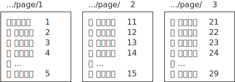
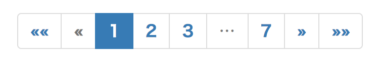

ページャーの基本
----

ページャとは、Google の検索結果のページなどで表示される、下記のようなものです。

{: .center }

あるカテゴリに属する記事のリストを表示するときや、数日分の日記をまとめて表示するようなケースでは、1 ページが長くなりすぎないように、ページャーを導入することを検討するのがよいでしょう。

Hugo でページャーを導入すると、デフォルトでは `/page/1`、`/page/2`、`/page/3` といった URL で、それぞれのグループ（複数の記事をまとめたページ）を表示するためのページにアクセスできるようになります（`page` というパスは、Hugo のコンフィグファイルの `PaginatePath` で変更できます）。

{: .center }

Hugo のページャー機能は、**ホームページとリスト系ページ（セクションページや、タクソノミーリスト）のみ**で有効です。
つまり、ホームページテンプレート (`layouts/index.html`) や、リストテンプレート (`layouts/_default/list.html`) などに適用することになります。

ホームページテンプレートに適用すれば、それぞれのグループを表示するためのページには、次のようなアドレスでアクセスできるようになります。

* https://example.com/**page/1** （https://example.com/ のエイリアス）
* https://example.com/**page/2**
* https://example.com/**page/3**

セクションテンプレートに適用した場合は、次のようなアドレスでアクセスできるようになります。

* https://example.com/xxx/**page/1** （https://example.com/xxx/ のエイリアス）
* https://example.com/xxx/**page/2**
* https://example.com/xxx/**page/3**

ここでのポイントは、上記のようなファイル群は、１つのホームページテンプレート（あるいはセクションテンプレート）から自動的に生成されるということです。
つまり、複数のページとして出力されてはいるものの、ページャー部分以外のコンテンツは同じになります。
後述するように、テンプレート内で **.Pagenator** にアクセスすると、Hugo は自動的にこれらのファイルを出力するようになります。

ちなみに、単独のページを出力するためのシングルページテンプレート (`layouts/_default/single.html`) ではページャ機能は使えないので、代わりに、[ページ切り替え用の「次のページ」、「前のページ」といったリンク](../template/next-prev-page.html)を表示しておくのがよいでしょう。

ページャーを導入する
----

### 組み込みの pagination テンプレートを使用する

1 グループごとの記事のリストは、`.Pagenator.Pages` で参照することができるようになっているので、これを `range` を使って列挙すれば OK です。
デフォルトでは 10 記事ごとがグルーピングされていますが、このサイズは Hugo のコンフィグファイルの `Paginate` で変更できます。
肝心のページ切り替え部分は、Hugo 組み込みのテンプレート `_internal/pagination.html` を使用して出力することができます。

よって、ページャー機能を使って、シンプルにグループ内の記事リンクを列挙し、さらに切り替え部分を表示するなら、下記のようなテンプレートを記述すればよいことになります。

#### layouts/index.html（ホームページテンプレート）の抜粋

~~~
<h3>ページリスト</h3>
<ul>
  {{ "{{" }}- range .Paginator.Pages }}
    <li><a href="{{ "{{" }} .RelPermalink }}">{{ "{{" }} .Title }}</a>
  {{ "{{" }}- end }}
</ul>

<h3>切り替え</h3>
{{ "{{" }} template "_internal/pagination.html" . }}
~~~

上記のようなテンプレートからは、下記のような HTML が出力されます。
ここでは、先頭のグループにアクセスするため、下記のいずれかのアドレスにアクセスしたと考えてください。

* https://example.com/
* https://example.com/page/1 （上記のエイリアス）

#### 出力結果

~~~ html
<h3>ページリスト</h3>
<ul>
  <li><a href="/title1/">タイトル1</a>
  <li><a href="/title2/">タイトル2</a>
  <li><a href="/title3/">タイトル3</a>
  <li><a href="/title4/">タイトル4</a>
  <li><a href="/title5/">タイトル5</a>
  <li><a href="/title6/">タイトル6</a>
  <li><a href="/title7/">タイトル7</a>
  <li><a href="/title8/">タイトル8</a>
  <li><a href="/title9/">タイトル9</a>
  <li><a href="/title10/">タイトル10</a>
</ul>

<h3>切り替え</h3>
<ul class="pagination">
  <li><a href="/" aria-label="First">&laquo;&laquo;</a></li>
  <li class="disabled"><a href="" aria-label="Previous">&laquo;</a></li>
  <li class="active"><a href="/">1</a></li>
  <li><a href="/page/2/">2</a></li>
  <li><a href="/page/3/">3</a></li>
  <li class="disabled">&hellip;</li>
  <li><a href="/page/8/">8</a></li>
  <li><a href="/page/2/" aria-label="Next">&raquo;</a></li>
  <li><a href="/page/8/" aria-label="Last">&raquo;&raquo;</a></li>
</ul>
~~~

後半のグループ切り替え部分は、Hugo 組み込みのテンプレート (`_internal/pagination.html`) によって出力されたもので、Bootstrap ベースの構造で出力されています。
Bootstrap を採用していない Web サイトでは、そのままでは思ったような表示にならないので、出力に合わせた CSS を定義してやる必要があります。

- ul 要素に設定される **pagination** クラス
- li 要素の **active** クラス（現在のページ）と **disabled** クラス（その他のページ）

あたりを考慮した CSS を記述すればよさそうです。
下記は、Bootstrap の `pagination` クラスまわりの定義を抜粋したものです。

~~~ css
.pagination {
  display: inline-block;
  padding-left: 0;
  margin: 20px 0;
  border-radius: 4px;
}
.pagination > li {
  display: inline;
}
.pagination > li > a,
.pagination > li > span {
  position: relative;
  float: left;
  padding: 6px 12px;
  margin-left: -1px;
  line-height: 1.42857143;
  color: #337ab7;
  text-decoration: none;
  background-color: #fff;
  border: 1px solid #ddd;
}
.pagination > li:first-child > a,
.pagination > li:first-child > span {
  margin-left: 0;
  border-top-left-radius: 4px;
  border-bottom-left-radius: 4px;
}
.pagination > li:last-child > a,
.pagination > li:last-child > span {
  border-top-right-radius: 4px;
  border-bottom-right-radius: 4px;
}
.pagination > li > a:hover,
.pagination > li > span:hover,
.pagination > li > a:focus,
.pagination > li > span:focus {
  z-index: 2;
  color: #23527c;
  background-color: #eee;
  border-color: #ddd;
}
.pagination > .active > a,
.pagination > .active > span,
.pagination > .active > a:hover,
.pagination > .active > span:hover,
.pagination > .active > a:focus,
.pagination > .active > span:focus {
  z-index: 3;
  color: #fff;
  cursor: default;
  background-color: #337ab7;
  border-color: #337ab7;
}
.pagination > .disabled > span,
.pagination > .disabled > span:hover,
.pagination > .disabled > span:focus,
.pagination > .disabled > a,
.pagination > .disabled > a:hover,
.pagination > .disabled > a:focus {
  color: #777;
  cursor: not-allowed;
  background-color: #fff;
  border-color: #ddd;
}
~~~

この CSS 定義を使用すると、ページャーの切り替え部分は下記のような表示になります。

{: .center }

### 切り替え部分のテンプレートを自作する

ページャーによる切り替え部分は、Hugo の組み込みテンプレート (`_internal/pagination.html`) を使って出力することができました。
この組み込みテンプレートの出力内容が気に入らない場合は、その内容を参考にしながら独自のテンプレートを作成することになるでしょう。
`_internal/pagination.html` の内容は、GitHub で参照することができます。

- [tpl/tplimpl/embedded/templates/pagination.html -- gohugoio/hugo](https://github.com/gohugoio/hugo/blob/master/tpl/tplimpl/embedded/templates/pagination.html)

参考サイト
----

* [Pagination｜Hugo](https://gohugo.io/templates/pagination/)

