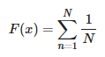

- 参考: [MathJax with Hugo](https://gohugo.io/content-management/formats/#mathjax-with-hugo)

MathJax を有効にする
----

まず、すべてのページで次のようにして MathJax.js を読み込む必要があります。

~~~ html

~~~

フッター用のパーシャルテンプレート（`layouts/partials/footer.html` など）を用意しているのであれば、その中に記述しておくのがよいでしょう。

CDN で提供されている最新の MathJax.js のアドレスは、[cdnjs.com のサイト](https://cdnjs.com/)で <kbd>MathJax</kbd> と入力するか、[MathJax のサイト](http://docs.mathjax.org/en/latest/configuration.html) で調べることができます。

ページ内に数式を記述する
----

あとは、Markdown ファイル内で `$$数式$$` というフォーマットで記述すれば、きれいな数式が表示されます。

#### Markdown ファイル内の記述

~~~
$$F(x) = \sum_{n=1}^{N} \frac{1}{N}$$
~~~

#### 表示例

{: .center }

インライン形式で数式を記述できるようにする
----

通常の文章の中にインライン形式で数式を埋め込むには、MathJax.js の設定を行っておく必要があります。
MathJax.js を読み込む HTML コードと一緒に、次のようなコードを追加してください。

#### テンプレート抜粋（layouts/partials/footer.html など）

~~~ html

~~~

上記のように設定しておくと、文章の中に `$数式$` というフォーマットで、数式をインラインで埋め込めるようになります。

#### Markdown ファイル内の記述

~~~
次の数式は $F(x) = \sum_{n=1}^{N} \frac{1}{N}$ 文章内に埋め込まれます。
~~~

#### 表示例

