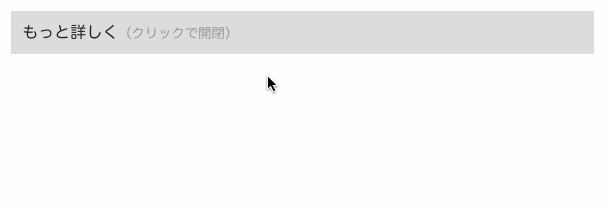

{: .center }

<center><b>図: accordion ショートコードによる開閉表示</b></center>

ブログ記事内の補足的な説明テキストなどは、デフォルトでは非表示にしておいて、必要なときにクリックで開閉できるようにしておくとスッキリします。
このような UI コンポーネントは、アコーディオン (accordion) と呼ばれることが多いので、ここでは `accordion` という名前のショートコードとして作成してみます。
`accordion` ショートコードは次のように使うことを想定しています。

#### Markdown 内での使用例

```
{{ "{{" }}% accordion title="もっと詳しく" %}}
この本文はデフォルトでは隠されていて、クリックで見えるようになります。

- サンプルコード
- 補足説明

などに使うと便利です。
{{ "{{" }}% /accordion %}}
```

__注:__ 本文のテキストを Markdown コードとして処理するためには、ショートコード名を `<` と `>` ではなく、上記のように `%` で囲む必要があります。

下記は、`accordion` ショートコードの実装例です。
クリックによる HTML 要素の表示／非表示の切り替えは、[input 要素の状態による CSS の切り替えテクニック](https://maku77.github.io/web/menu/accordion.html) を利用しています。
`label` 要素と `input` 要素を結びつける ID には、[Hugo の関数でランダムに生成した文字列](../misc/random.html) を使用しています。

#### layouts/shortcodes/accordion.html

```
{{ "{{" }}- $title := .Get "title" | default "例" }}
{{ "{{" }}- $rand := delimit (seq 9 | shuffle) "" }}
<div class="xAccordion">
  <label class="xAccordion_title" for="id-{{ "{{" }} $rand }}">{{ $title }}</label>
  <input id="id-{{ "{{" }} $rand }}" type="checkbox">
  <div class="xAccordion_body">
    {{ "{{" }} .Inner }}
  </div>
</div>
```

上記の出力に合わせて、次のようなスタイルシートを読み込んでおく必要があります。
ここでは、[SCSS によるスタイル記述が有効化](https://maku77.github.io/hugo/advanced/sass.html) されていることを想定していますが、通常の CSS で記述しても大丈夫です。
表示スタイルはここで自由に変更できます。

#### common.scss

```scss
.xAccordion {
  /* タイトル */
  &_title {
    display: block;
    padding: 0.5rem 0.7rem;
    background: #ddd;
    cursor: pointer;
    &::after {
      font-size: smaller;
      color: #999;
      content: "（クリックで開閉）";
    }
    &:hover {
      background: #ccc;
    }
  }

  &_body {
    display: none;  /* デフォルトでは本文は非表示 */

    /* 本文の共通設定 */
    border: solid lightgray 1px;
    padding: 0.5rem;
  }

  input {
    display: none;  /* チェックボックスは非表示 */

    /* ラベルをクリックしたら本文を開く（表示） */
    &:checked + .xAccordion_body {
      display: block;
    }
  }
}
```

