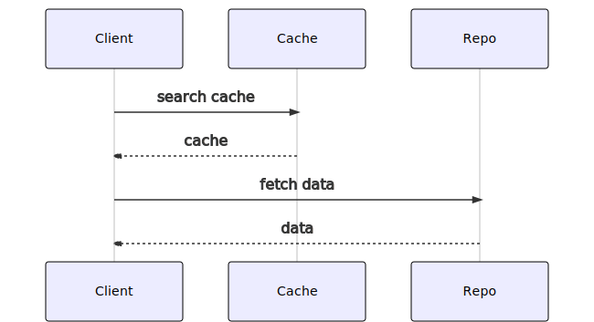

.HasShortcode 関数
----

外部の JavaScript ファイルを利用して動作するショートコードを作成すると、Web サイトの表現力を大きく向上させることができます。
例えば、次のようなショートコードが考えられます。

- 独自の構文でコードを記述すると UML 図を出力してくれる `mermaid` ショートコード（[mermaid.js](https://mermaid-js.github.io/mermaid/) などを利用）
- TeX 構文でコードを記述すると数式を出力してくれる `math` ショートコード（[MathJax.js](https://www.mathjax.org/) などを利用）

このとき悩ましいのが、どのようにして次のような `script` 要素を出力するかです。

```html
<script src="for-shortcode.min.js"></script>
```

すべてのページにこのようなコードを出力してしまうと、この JavaScript が必要ないページでもファイルのロードが発生してしまいます。
こういった拡張が増えてくると、大量の JavaScript ファイルが読み込まれることになり、重い Web サイトになってしまいます。

このような場合の救世主が __`Page.HasShortcode`__ 関数です。

- 参考: [Hugo - Create Your Own Shortcodes - Checking for Existence](https://gohugo.io/templates/shortcode-templates/#checking-for-existence)

ページテンプレート内で、

```
{{ "{{" }} if .HasShortcode "my-shortcode" }}
  ...
{{ "{{" }} end }}
```

といった記述をしておくと、Markdown ファイル内で `my-shortcode` ショートコードを使用している場合のみ出力を行うことができます。


実装例
----

例えば、ベーステンプレートの `body` 要素の末尾に次のように記述しておけば、Markdown ファイル内で `mermaid` ショートコードを使用している場合のみ、`mermaid.js` の読み込みと初期化処理を実行することができます。

#### layouts/_default/baseof.html（抜粋）

```html
  ...
  {{ "{{" }}- if .HasShortcode "mermaid" }}
    <script src="https://cdn.jsdelivr.net/npm/mermaid/dist/mermaid.min.js"></script>
    <script>mermaid.initialize({startOnLoad: true});</script>
  {{ "{{" }}- end }}
</body>
</html>
```

ちなみに、`mermaid` ショートコードの実装は次のような感じになっています。

#### layouts/shortcodes/mermaid.html

```html
<div class="mermaid">
{{ "{{" }} .Inner }}
</div>
```

#### Markdown ファイル内での使い方

```
{{ "{{" }}< mermaid >}}
sequenceDiagram
    Client->>Cache: search cache
    Cache-->>Client: cache
    Client->>Repo: fetch data
    Repo-->>Client: data
{{ "{{" }}< /mermaid >}}
```

#### 表示結果




（応用）他のページを間接的に出力するとき
----

### baseof.html での .HasShortcode がうまく動作しない例

`Page.HasShortcode` 関数は、あくまで現在処理しようとしているページの Markdown 内でショートコードが使われているかどうかを調べます。
例えば、ホームページテンプレートで、次のように最新記事の内容を間接的に取得して表示しているような場合は、`baseof.html` テンプレートに記述した `.HasShortcode` 関数は意図通り動作しない可能性があります。

```
<!-- 最近の記事をいくつかまとめて表示 -->
{{ "{{" }}- range first 3 .Site.RegularPages.ByLastmod.Reverse -}}
  <article class="xArticle" itemscope itemtype="https://schema.org/BlogPosting">
    {{ "{{" }} .Render "inc-article" }}
  </article>
{{ "{{" }}- end -}}
```

なぜなら、ホームページ (`content/_index.md`) の Markdown ファイルではショートコードを使っていないのにもかかわらず（`.HasShortcode` が `false` になる）、上記ループで表示される別ページ内で JavaScript のロードを必要としていることがあるからです。

このようなケースに対応するには、上記のような `Page` オブジェクトをループしている部分で、`.HasShortcode` によるチェックを行わなければいけません。
ただし、ループ内で JavaScript ファイルをロードする `script` 要素を出力してしまうと、ロードタイミングとしてはよろしくない（できれば `body` の末尾がいい）し、ロード用のコードが重複してしまいます。

### 解決案

解決方法はいろいろありそうですが、ひとつの解決方法としては、ショートコード内で、自分自身が必要とする JavaScript ファイル（下記の例では `mermaid.min.js`）をロードする JavaScript コードを出力してしまうという方法です。

#### layouts/shortcodes/mermaid.html

```html
<div class="mermaid">
{{ "{{" }}.Inner }}
</div>

<script>
(function() {
  const JS_FILE = 'https://cdn.jsdelivr.net/npm/mermaid/dist/mermaid.min.js';

  // JSファイルの多重ロードを防止
  const jsSet = window.LOADED_JS_SET = window.LOADED_JS_SET || new Set();
  if (jsSet.has(JS_FILE)) return;
  jsSet.add(JS_FILE);

  // JSファイルの動的読み込み
  const script = document.createElement('script');
  script.src = JS_FILE;
  script.onload = function() {
    // 必要に応じてJSファイルロード後に初期化処理
    mermaid.initialize({startOnLoad: true});
  }
  document.body.appendChild(script);
})();
</script>
```

すでにロードした JavaScript の情報は、グローバルな `window.LOADED_JS_SET` 変数に格納しておくことで重複ロードを防いでいます。
この方法であれば、`baseof.html` などのベーステンプレートで `script` 要素を出力する必要もなく、ショートコード用のファイルだけで完結できます。
ある意味 `.HasShortcode` を使う方法よりもすっきりするかもしれません。

この方法の欠点としては、このショートコードを使うたびに同じ JavaScript コードが出力されてしまうという点でしょうか。
とはいえ、ページ内でのショートコードの呼び出し回数が高々数回程度であるのであれば、それほど気にしなくてもいいと思います。

