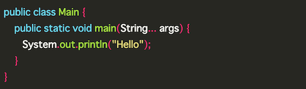
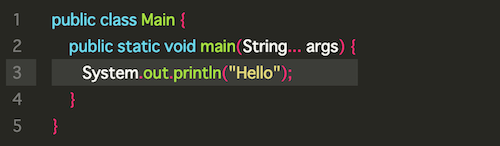
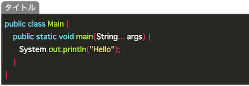

Pygments によるコードハイライト
----

Hugo の設定ファイル `config.toml` の中で、下記のように設定しておくと、[Pygments](http://pygments.org/) によるコードブロックのハイライト機能を有効にできます。

~~~ toml
pygmentsCodeFences = true
~~~

例えば、Java のソースコードであれば、Markdown ファイルの中で、下記のように言語名 `java` を指定してコードを囲みます。

~~~
```java
public class Main {
    public static void main(String... args) {
       System.out.println("Hello");
    }
}
```
~~~

#### ハイライトされた表示例




highlight ショートコードによるコードハイライト
----

Hugo の組み込みショートコードとして **`highlight`** が用意されています。
このショートコードを使用すると、`pyghmentsCodeFences` を使う方法よりも高度なコードハイライトを行えます。
例えば、下記のように、行番号を表示したり、特定の行を強調表示することができます。

~~~
{{ "{{" }}< highlight java "linenos=table, hl_lines=3" >}}
public class Main {
    public static void main(String... args) {
       System.out.println("Hello");
    }
}
{{ "{{" }}< /highlight >}}
~~~

#### ハイライトされた表示例



色々なオプションが用意されているので、詳しくは下記の Hugo ドキュメントを参照してください。

- [Hugo - Syntax Highlighting](https://gohugo.io/content-management/syntax-highlighting/)


キャプションを付けられる独自のショートコードを作成する
----

ソースコードの表示をキャプション付きでマークアップする場合は、HTML では下記のように `figure`、`figcaption` タグを使って記述します。

```html
<figure>
<figcaption>サンプルコード</figcaption>
<pre><code>
public class Main {
    public static void main(String... args) {
        System.out.println("Hello");
    }
}
</code></pre>
</figure>
```

このようなコードを手書きで毎回記述するのは大変なので、独自のショートコードを作ってしまうのがオススメです。
ここでは **`code`** というショートコードを作成し、コードブロックをタイトル付きでハイライト表示できるようにします。
ハイライト機能自体は自力で実装するのは大変なので、Hugo の組み込み関数として用意されている [highlight 関数](https://gohugo.io/functions/highlight/) を利用します（Hugo の組み込みの `highlight` ショートコードも、この `highlight` 関数を使って実装されています）。

#### layouts/shortcodes/code.html

```
{{ "{{" }} $title := .Get "title" }}
{{ "{{" }} $lang := or (.Get "lang") "" }}
<figure class="xCodeBlock">
{{ "{{" }} with $title }}<figcaption class="xCodeBlock_title">{{ "{{" }}.}}</figcaption>{{ "{{" }} end }}
<div class="xCodeBlock_code">{{ "{{" }} highlight (trim .Inner "\r\n") $lang "" }}</div>
</figure>
```

#### Markdown ファイル内での使い方

```
{{ "{{" }}< code lang="java" title="タイトル" >}}
public class Main {
    public static void main(String... args) {
        System.out.println("Hello");
    }
}
{{ "{{" }}< /code >}}
```

#### ハイライトされた表示例



ちなみに、上記のようなタイトル表示を行うようために、下記のような CSS 定義を行っています。

```css
.xCodeBlock_title {
  display: inline-block;
  font-size: smaller;
  border-radius: 0.5em 0.5em 0 0;
  padding: 0 0.5em;
  background: gray;
  color: white;
}
.xCodeBlock_code {
  margin-top: -2px;
}
.xCodeBlock_code pre {
  padding: 0.5em;
  white-space: pre-wrap;
}
```


参考: Hugo の highlight ショートコードの実装
----

- [hugo/tpl/tplimpl/embedded/templates/shortcodes/highlight.html - gohugoio/hugo - GitHub](https://github.com/gohugoio/hugo/blob/9c1e82085eb07d5b4dcdacbe82d5bafd26e08631/tpl/tplimpl/embedded/templates/shortcodes/highlight.html)

```
{{ "{{" }} if len .Params | eq 2 }}
  {{ "{{" }} highlight (trim .Inner "\n\r") (.Get 0) (.Get 1) }}
{{ "{{" }} else }}
  {{ "{{" }} highlight (trim .Inner "\n\r") (.Get 0) "" }}
{{ "{{" }} end }}
```
