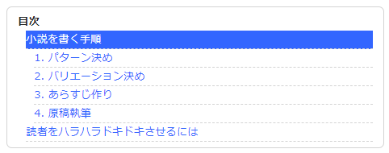

Hugo の目次機能
----

各ページの Markdown ファイル (`.md`) では、`##` や `----` を使ったセクション（`h2` 要素として出力される）を記述していると思います。
Hugo には、これらの**セクション名から自動的に目次 (Table of Contents) を出力する機能**が付いています。
下記は、自動的に出力した目次の例です。

{: .center }


テンプレートの記述方法（v0.59以前）
----

目次を自動的に出力するには、テンプレートファイル内で **`.TableOfContents`** というページ変数を参照します。

#### layouts/_default/single.html（抜粋）

```
{{ "{{" }}- with .TableOfContents }}
  <aside class="xToc">
    <div class="xToc_title">目次</div>
    {{ "{{" }} . }}
  </aside>
{{ "{{" }}- end }}
```

ここでは、目次情報がないときに何も表示しないように、`with` で分岐処理を行っています（2019-12-26 追記: v0.60.0 以降は出力内容が変わったため、このように分岐処理を行えなくなりました。次のセクションを参照してください）。

Hugo が自動的に生成する `.TableOfContents` の値は、`ul` 要素と `li` 要素によって構成されています。
出力された HTML の内容を見て、スタイルシート (CSS) の調整をするとよいでしょう。
下記は CSS の記述例です。

```css
.xToc {
  font-size: smaller;
  border-radius: 0.5em;
  border: solid 1px lightgray;
  padding: 0.5em 1em;
  line-height: 2;
}
.xToc_title {
  font-weight: bolder;
}
.xToc ul {
  list-style-type: none;
  padding-left: 0;
}
.xToc li {
  padding-top: 0 !important;
}
.xToc li > ul {
  padding-left: 1em;
  width: 100%;
}
.xToc a {
  font-weight: normal;
  display: block;
  border-bottom: dashed 1px lightgray;
}
```


テンプレートの記述方法（v0.60以降）
----

Hugo v0.60 から Markdown パーサーが Goldmark に変更され、Table of Contents の出力内容も変わってしまいました。
これまでは、ページ内に見出し（`H2` 要素など）が存在しない場合は、`.TableOfContents` 変数の値は空っぽになっていたので、その場合は「目次」というタイトルも含めて何も出力しない、という制御ができていました。
しかし、v0.60 以降は、ページ内に一切見出しが存在しなくても `.TableOfContents` の値には次のような文字列が入ってしまいます。

```
<nav id="TableOfContents"></nav>
```

まったく、、何してくれんのっ。と怒らずに、こんな変更も楽しむ器量が必要ですね（′・ω・｀）

しょうがないので、Hugo テンプレートファイルの中では分岐処理などを行わずに、素直に `.TableOfContents` の値を出力しておきます。

#### layouts/_default/single.html（抜粋）

```
{{ "{{" }} .TableOfContents }}
```

「目次」というタイトルを表示するかどうかの制御は、CSS で行うことにしましょう。
ここでは、`#TableOfContents` という ID の HTML 要素の直下に `ul` 要素があるときのみ、その直前に「目次」というテキストを挿入しています。

```css
#TableOfContents > ul {
  font-size: smaller;
  border-radius: 0.5em;
  border: solid 1px lightgray;
  padding: 0.5em 1em;
  line-height: 2;
}
#TableOfContents > ul:before {
  content: "目次";
  font-weight: bolder;
}
#TableOfContents ul {
  list-style-type: none;
}
#TableOfContents li {
  padding-top: 0;
}
#TableOfContents li > ul {
  padding-left: 1em;
  width: 100%;
}
#TableOfContents a {
  font-weight: normal;
  display: block;
  border-bottom: dashed 1px lightgray;
}
```

これで、ある程度は目次の見た目を制御できます。
本当は、ツールが生成する要素の ID (`#TableOfContents`) に依存する CSS などは記述したくないのですが、仕方ありません。
Hugo がうまい制御方法を用意してくれるまでこれで凌ぎます。


参考
----

- [Table of Contents ｜ Hugo](https://gohugo.io/content-management/toc/)

