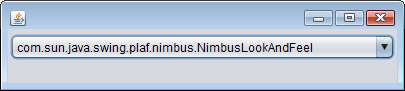

Swing コンポーネントの見た目を切り替えるには、下記のメソッドで任意のルック＆フィールを設定し、

~~~
void javax.swing.UIManager#setLookAndFeel(LookAndFeel newLookAndFeel)
void javax.swing.UIManager#setLookAndFeel(String className)
~~~

下記のメソッドに、ルートとなる JFrame オブジェクトを指定します。

~~~
void javax.swing.SwingUtilities#updateComponentTreeUI(Component c)
~~~

#### 例: コンボボックスでルック＆フィールを切り替える

~~~ java
import java.awt.event.ActionEvent;
import java.awt.event.ActionListener;
import javax.swing.JComboBox;
import javax.swing.JFrame;
import javax.swing.JPanel;
import javax.swing.SwingUtilities;
import javax.swing.UIManager;

public class Main {
     private static class MainPanel extends JPanel {
          private static final long serialVersionUID = -2481223364939864729L;
          private JFrame frame;

          public MainPanel(JFrame frame) {
               this.frame = frame;
               initComponents();
          }

          private void initComponents() {
               JComboBox combo = new JComboBox();
               addLookAndFeels(combo);
               addComboListener(combo);
               add(combo);
          }

          // List all look and feels to the combo box.
          private void addLookAndFeels(JComboBox combo) {
               UIManager.LookAndFeelInfo[] info = UIManager.getInstalledLookAndFeels();
               for (int i = 0; i < info.length; ++i) {
                    combo.addItem(info[i].getClassName());
               }
          }

          // Change the look and feel of JFrame when the selection changes.
          private void addComboListener(final JComboBox combo) {
               combo.addActionListener(new ActionListener() {
                    @Override
                    public void actionPerformed(ActionEvent event) {
                         try {
                              UIManager.setLookAndFeel((String) combo.getSelectedItem());
                              SwingUtilities.updateComponentTreeUI(frame);
                         } catch (Exception e) {
                              e.printStackTrace();
                         }
                    }
               });
          }
     }

     public static void main(String[] args) {
          JFrame frame = new JFrame();
          frame.setDefaultCloseOperation(JFrame.EXIT_ON_CLOSE);
          frame.getContentPane().add(new MainPanel(frame));
          frame.pack();
          frame.setVisible(true);
     }
}
~~~

