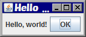

下記は、Swing を使って簡単なウィンドウを表示するサンプルです。

#### 表示結果

#### Main.java

~~~ java
import java.awt.FlowLayout;
import javax.swing.JButton;
import javax.swing.JFrame;
import javax.swing.JLabel;

public class Main {
    public static void main(String[] args) {
        // Create and set up the window.
        JFrame frame = new JFrame("Hello World");
        frame.setDefaultCloseOperation(JFrame.EXIT_ON_CLOSE);

        // Add contents to the window.
        frame.setLayout(new FlowLayout());
        frame.add(new JLabel("Hello, world!"));
        frame.add(new JButton("OK"));

        // Display the window.
        frame.pack();
        frame.setVisible(true);
    }
}
~~~

`JFrame` の content pane (Component) に対して、１つの `JPanel` を配置するだけの場合は、`Component.add()` するより、以下のように content pane 自体を置き換えてしまった方がシンプルです。

~~~ java
frame.setContentPane(new MyPanel());
~~~

- 参考: [Swing チュートリアルの Hello World](http://download.oracle.com/javase/tutorial/uiswing/examples/start/HelloWorldSwingProject/src/start/HelloWorldSwing.java)

