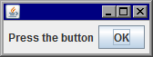

Swing で GUI コンポーネントを配置していくときは、基本的に JPanel 上に配置していくことになります。
複数の JPanel を入れ子で配置していくようなケースでは、JPanel を継承した独自クラスを作成することで、GUI 関連のコードを意味のある単位で分割していくことができます。

下記のサンプルでは、MainPanel という独自の JPanel クラスを作成し、それをトップレベルコンテナである JFrame に配置しています。

#### サンプルコードの実行結果

#### MainPanel.java

~~~ java
import java.awt.FlowLayout;
import javax.swing.JButton;
import javax.swing.JLabel;
import javax.swing.JPanel;

public class MainPanel extends JPanel {
    private static final long serialVersionUID = -1268071400322262373L;

    public MainPanel() {
        initComponents();
    }

    private void initComponents() {
        setLayout(new FlowLayout());
        add(new JLabel("Press the button"));
        add(new JButton("OK"));
    }
}
~~~

#### Main.java

~~~ java
import javax.swing.JFrame;

public class Main {
    public static void main(String[] args) {
        JFrame frame = new JFrame();
        frame.setContentPane(new MainPanel());
        frame.pack();
        frame.setDefaultCloseOperation(JFrame.EXIT_ON_CLOSE);
        frame.setVisible(true);
    }
}
~~~

上記の MainPanel クラスは JPanel を継承して実装していますが、下記のように JPanel を内包する形で実装することもできます。

#### MainPanel.java（継承を使わないバージョン）

~~~ java
import java.awt.FlowLayout;
import javax.swing.JButton;
import javax.swing.JComponent;
import javax.swing.JLabel;
import javax.swing.JPanel;

public class MainPanel {
    private final JComponent panel = new JPanel();

    public MainPanel() {
        initComponents();
    }

    public JComponent getView() {
        return panel;
    }

    private void initComponents() {
        panel.setLayout(new FlowLayout());
        panel.add(new JLabel("Press the button"));
        panel.add(new JButton("OK"));
    }
}
~~~

内部で初期化した JPanel を外から取得するために、public な `getView()` メソッドを用意しています。
Java では多重継承が許されていないため、このような実装が必要になることがあります。

