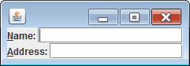

JPanel の以下のメソッドでショートカットキーを割り当て、

~~~
void JPanel#setDisplayedMnemonic(char aChar)
~~~

さらに、以下のメソッドでラベルにコンポーネントを関連付けると、ショートカットキーで関連付けたコンポーネントにフォーカスを移動することができます。

~~~
void JPanel#setLabelFor(Component c)
~~~

Windows の場合は、Alt + A などのショートカットキーでフォーカスを移動できるようになります。

#### サンプルコード

~~~ java
import java.awt.BorderLayout;
import javax.swing.BoxLayout;
import javax.swing.JLabel;
import javax.swing.JPanel;
import javax.swing.JTextField;

public class MyPanel extends JPanel {
    private static final long serialVersionUID = 1L;

    public MyPanel() {
        // Create a panel for a name.
        JPanel namePanel = new JPanel();
        namePanel.setLayout(new BoxLayout(namePanel, BoxLayout.X_AXIS));
        JLabel nameLabel = new JLabel("Name: ");
        JTextField nameText = new JTextField();
        nameText.setColumns(15);
        nameLabel.setDisplayedMnemonic('N');
        nameLabel.setLabelFor(nameText);
        namePanel.add(nameLabel);
        namePanel.add(nameText);

        // Create a panel for an e-mail.
        JPanel addrPanel = new JPanel(new BorderLayout());
        addrPanel.setLayout(new BoxLayout(addrPanel, BoxLayout.X_AXIS));
        JLabel addrLabel = new JLabel("Address: ");
        JTextField addrText = new JTextField();
        addrText.setColumns(15);
        addrLabel.setDisplayedMnemonic('A');
        addrLabel.setLabelFor(addrText);
        addrPanel.add(addrLabel, BorderLayout.WEST);
        addrPanel.add(addrText, BorderLayout.CENTER);

        // Add the panels to the parent panel.
        setLayout(new BoxLayout(this, BoxLayout.Y_AXIS));
        add(namePanel);
        add(addrPanel);
    }
}
~~~

