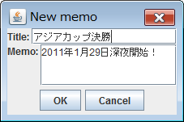
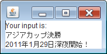

OK/Cancel ボタンを持つダイアログのベースクラス（OkCancelDialog クラス）
----

以下の OkCancelDialog クラスは、OK と Cancel の２つのボタンがあるダイアログを表示するための基底クラスです。
このクラスを継承したダイアログクラスを実装することで、OK と Cancel ボタン以外のコンポーネントを自由に配置することができます。
`open()` メソッドを実行するとダイアログを開き、ユーザーが OK、あるいは Cancel ボタンを押すと、それぞれ `true`、`false` を返してダイアログが閉じます。

- [OkCancelDialog クラス (OkCancelDialog.java)](./OkCancelDialog.java)

OkCancelDialog クラスの使用例
----

下記は、OkCancelDialog クラスの使用例で、ダイアログ上にメモを入力できるようにしています。
アプリケーションを実行すると、下記のような入力ダイアログが開きます。

このダイアログ上でメモを入力して OK ボタンを押すと、メインフレーム側にその内容が表示されます。

#### Main.java

~~~ java
import javax.swing.JFrame;
import javax.swing.JTextArea;

public class Main {
    public static void main(String[] a) {
        // Show a root frame.
        JFrame frame = new JFrame();
        JTextArea textArea = new JTextArea(3, 15);
        frame.setContentPane(textArea);
        frame.pack();
        frame.setDefaultCloseOperation(JFrame.EXIT_ON_CLOSE);
        frame.setVisible(true);

        // Show a modal dialog owned by the root frame.
        NewMemoDialog dialog = new NewMemoDialog(frame);
        if (dialog.open()) {
            // Obtain input data.
            MemoData data = dialog.getMemoData();
            textArea.setText("Your input is:\n" +
                    data.getTitle() + "\n" +
                    data.getMemo());
        }
    }
}
~~~

#### MemoData.java

~~~ java
public class MemoData {
    private String title;
    private String memo;

    public String getTitle() { return title; }
    public String getMemo() { return memo; }

    public MemoData(String title, String memo) {
        this.title = title;
        this.memo = memo;
    }
}
~~~

#### NewMemoDialog.java

~~~ java
import java.awt.BorderLayout;
import java.awt.Component;
import javax.swing.BoxLayout;
import javax.swing.JFrame;
import javax.swing.JLabel;
import javax.swing.JPanel;
import javax.swing.JScrollPane;
import javax.swing.JTextArea;
import javax.swing.JTextField;

public class NewMemoDialog extends OkCancelDialog {
    private static final long serialVersionUID = 7442558474896173264L;
    private JTextField titleText;
    private JTextArea memoText;

    public NewMemoDialog(JFrame owner) {
        super(owner);
        setTitle("New memo");
        setResizable(true);

        // Set an input panel as a main panel of OkCancelDialog.
        setMainPanel(createMainPanel());
    }

    public MemoData getMemoData() {
        return new MemoData(titleText.getText(), memoText.getText());
    }

    private JPanel createMainPanel() {
        JPanel panel = new JPanel(new BorderLayout());
        panel.setLayout(new BorderLayout());
        panel.add(createTitlePanel(), BorderLayout.NORTH);
        panel.add(createMemoPanel(), BorderLayout.CENTER);
        return panel;
    }

    private JPanel createTitlePanel() {
        JPanel panel = new JPanel();
        panel.setLayout(new BoxLayout(panel, BoxLayout.X_AXIS));
        JLabel label = new JLabel("Title: ");
        titleText = new JTextField();
        titleText.setColumns(15);
        panel.add(label);
        panel.add(titleText);
        return panel;
    }

    private JPanel createMemoPanel() {
        JPanel panel = new JPanel();
        panel.setLayout(new BoxLayout(panel, BoxLayout.X_AXIS));
        JLabel label = new JLabel("Memo: ");
        label.setAlignmentY(Component.TOP_ALIGNMENT);
        memoText = new JTextArea(3, 15);
        memoText.setWrapStyleWord(true);
        memoText.setLineWrap(true);
        JScrollPane scroll = new JScrollPane(memoText);
        scroll.setAlignmentY(Component.TOP_ALIGNMENT);
        panel.add(label);
        panel.add(scroll);
        return panel;
    }
}
~~~

