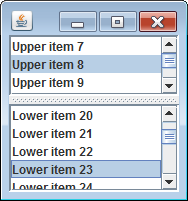

JSplitPane を使用して２つのコンポーネントを配置すると、スプリッターのドラッグによって分割位置を動かすことができるようになります。

上下、左右のどちらの方向に分割するかは、JSplitPane のコンストラクタの第一引数で、以下の定数値で指定します。

- `JSplitPane.HORIZONTAL_SPLIT` -- 左右に分割
- `JSplitPane.VERTICAL_SPLIT` -- 上下に分割

以下のサンプルでは、２つの JScrollPane を JSplitPane で分割して配置しています。

~~~ java
import java.awt.BorderLayout;
import javax.swing.AbstractListModel;
import javax.swing.JList;
import javax.swing.JPanel;
import javax.swing.JScrollPane;
import javax.swing.JSplitPane;

public class MyPanel extends JPanel {
    public MyPanel() {
        // Create lists.
        JList list1 = new JList(new MyListModel("Left item "));
        JList list2 = new JList(new MyListModel("Right item "));
        list1.setLayoutOrientation(JList.VERTICAL);
        list2.setLayoutOrientation(JList.VERTICAL);
        JScrollPane scrollPane1 = new JScrollPane(list1);
        JScrollPane scrollPane2 = new JScrollPane(list2);

        // Create a split pane.
        JSplitPane splitPane = new JSplitPane(JSplitPane.HORIZONTAL_SPLIT,
                scrollPane1, scrollPane2);

        // Set the split pane as a root pane.
        setLayout(new BorderLayout());
        add(splitPane, BorderLayout.CENTER);
    }

    // Data model for JList.
    public class MyListModel extends AbstractListModel {
        private String prefix;

        public MyListModel(String prefix) {
            this.prefix = prefix;
        }

        @Override
        public Object getElementAt(int index) {
            return prefix + index;
        }

        @Override
        public int getSize() {
            return 100;
        }
    }
}
~~~

