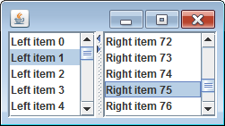
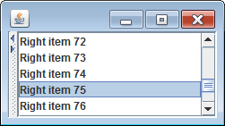
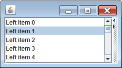

JSplitPane の以下のメソッドで `true` を指定すると、スプリッター上のボタンなどを押して、左側のペーン、あるいは右側のペーンをワンタッチで折り畳めるようになります。

~~~ java
public void JSplitPane.setOneTouchExpandable(boolean newValue)
~~~

#### 初期状態

#### 左側のペーンを折りたたんだ状態

#### 右側のペーンを折りたたんだ状態

この折り畳み機能がデフォルトで有効になっているかは、現在使用しているルック＆フィールによります。
Java ルック＆フィールを使用している場合は、デフォルトで無効になっています。

#### 使用例

~~~ java
// JSplitPane splitPane = new JSplitPane(JSplitPane.HORIZONTAL_SPLIT, leftPane, rightPane);

splitPane.setOneTouchExpandable(true);
~~~

