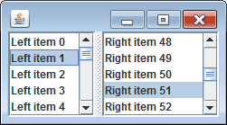
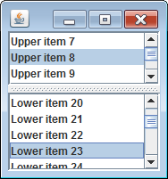

JSplitPane の分割方向は、以下のメソッドを使用することで動的に変更することができます。

~~~ java
void JSplitPane.setOrientation(int orientation)
~~~

#### orientation = `JSplitPane.HORIZONTAL_SPLIT`

#### orientation = `JSplitPane.VERTICAL_SPLIT`

#### 使用例

~~~ java
// JSplitPane splitPane = new JSplitPane(...);

splitPane.setOrientation(JSplitPane.VERTICAL_SPLIT);
~~~

