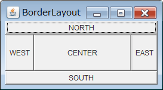
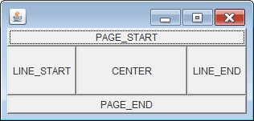
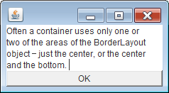

BorderLayout は JFrame の content pane にデフォルトで設定されているレイアウトマネージャで、上下左右にコンポーネントを配置します。

BorderLayout を設定した Container に対して、各コンポーネントを `add()` していく時は、第２パラメータでどの位置にコンポーネントを配置するかを指定します。
同じ位置に別のコンポーネントを配置しようとすると、後から配置したコンポーネントが表示されます。

- `BorderLayout.CENTER`（中央）（デフォルト位置）
- `BorderLayout.NORTH`（上）
- `BorderLayout.SOUTH`（下）
- `BorderLayout.WEST`（左）
- `BorderLayout.EAST`（右）

~~~ java
public class MyPanel extends JPanel {
    public MyPanel() {
        setLayout(new BorderLayout());
        add(new Button("CENTER"), BorderLayout.CENTER);
        add(new Button("NORTH"), BorderLayout.NORTH);
        add(new Button("SOUTH"), BorderLayout.SOUTH);
        add(new Button("WEST"), BorderLayout.WEST);
        add(new Button("EAST"), BorderLayout.EAST);
    }
}
~~~

Java Tutorials の中では、NORTH, SOUTH, WEST, EAST による絶対的な位置指定の代わりに、下記のような定数を用いることが推奨されています。
下記の定数を使用することで、Locale 設定に基づいた表示位置で描画するようになります。
例えば、`BorderLayout.LINE_START` は通常、「左」を意味しますが、ユーザが右から左へ表示する言語 (RtoL) を使用している場合は、`BorderLayout.LINE_START` は自動的に「右」を意味するようになります。

~~~ java
public class MyPanel extends JPanel {
    public MyPanel() {
        setLayout(new BorderLayout());
        add(new Button("CENTER"), BorderLayout.CENTER);
        add(new Button("PAGE_START"), BorderLayout.PAGE_START);
        add(new Button("PAGE_END"), BorderLayout.PAGE_END);
        add(new Button("LINE_START"), BorderLayout.LINE_START);
        add(new Button("LINE_END"), BorderLayout.LINE_END);
    }
}
~~~

BorderLayout ですべての位置にコンポーネントを配置することはあまりなく、通常は１つだけ中央に配置したり、中央＋上下左右いずれかの２つのコンポーネントを配置するためによく使用されます。
下記の例では、中央 (CENTER) と、下 (SOUTH) にコンポーネントを配置しています。

~~~ java
public class MyPanel extends JPanel {
    public MyPanel() {
        setLayout(new BorderLayout());
        add(new JTextArea(4, 20), BorderLayout.CENTER);
        add(new Button("OK"), BorderLayout.SOUTH);
    }
}
~~~

