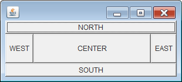

BorderLayout を設定した Container のサイズを広げると、中央 (`BorderLayout.CENTER`) に置かれたコンポーネントのサイズが広がるため、一般的には、ユーザーに多くの領域を見せたいコンポーネントを中央に配置します。

ただし、JFrame の `pack()` メソッドを読んだ時点では、中央のコンポーネントは preferred size に設定されるため、ほとんどの場合デフォルトでは小さく表示されます。
JFrame を表示したときに、最初から中央のコンポーネントを指定したサイズで見せたい場合は、中央に配置するコンポーネントに以下のように preferred size を設定します。

~~~ java
centerButton.setPreferredSize(new Dimension(200, 50));
~~~

#### サンプルコード

~~~ java
import java.awt.BorderLayout;
import java.awt.Button;
import java.awt.Dimension;
import javax.swing.JFrame;
import javax.swing.JPanel;

public class Main {
    private static class MyPanel extends JPanel {
        public MyPanel() {
            setLayout(new BorderLayout());

            // 中央に配置するコンポーネントのデフォルトサイズを指定
            Button center = new Button("CENTER");
            center.setPreferredSize(new Dimension(200, 50));
            add(center, BorderLayout.CENTER);

            add(new Button("NORTH"), BorderLayout.NORTH);
            add(new Button("SOUTH"), BorderLayout.SOUTH);
            add(new Button("EAST"), BorderLayout.EAST);
            add(new Button("WEST"), BorderLayout.WEST);
        }
    }

    public static void main(String[] a) {
        JFrame frame = new JFrame("FlowLayout");
        frame.setContentPane(new MyPanel());
        frame.pack();
        frame.setDefaultCloseOperation(JFrame.EXIT_ON_CLOSE);
        frame.setVisible(true);
    }
}
~~~

中央に配置するコンポーネントの preferred size を設定するのではなく、そのコンポーネントを含んでいる JPanel (Container) 自体の preferred size を指定することもできます。
JPanel を継承したクラスを作成している場合にその preferred size を指定したい場合は、`JComponent.getPreferredSize()` をオーバーライドしてサイズを設定する必要があります。

~~~ java
public class MyPanel extends JPanel {
    ...
    @Override
    public Dimension getPreferredSize() {
        return new Dimension(500, 300);
    }
}
~~~

もちろん、最上位の Container である JFrame のサイズを以下のように設定している場合は、そのサイズ指定が最優先されます。

~~~ java
frame.setSize(1000, 300);
~~~

