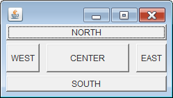

BorderLayout で配置するコンポーネント間に隙間を入れるには、コンストラクタか、`setHgap()`、`setVgap()` メソッドでそのサイズを指定します。

~~~ java
BorderLayout(int horizontalGap, int verticalGap);
void setHgap(int hgap);
void setVgap(int vgap);
~~~

下記の例では、横方向に 5px、縦方向に 10px の隙間を設定しています。

~~~ java
public class MyPanel extends JPanel {
    public MyPanel() {
        setLayout(new BorderLayout(10, 5));
        add(new Button("CENTER"), BorderLayout.CENTER);
        add(new Button("NORTH"), BorderLayout.NORTH);
        add(new Button("SOUTH"), BorderLayout.SOUTH);
        add(new Button("WEST"), BorderLayout.WEST);
        add(new Button("EAST"), BorderLayout.EAST);
    }
}
~~~

