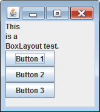

コンポーネントを横方向、あるいは、縦方向に一列に並べるには、レイアウトマネージャとして `javax.swing.BoxLayout` を使用します。
並べる方向はコンストラクタで指定することができます。

- `BoxLayout.X_AXIS` -- 横方向
- `BoxLayout.Y_AXIS` -- 縦方向

~~~ java
import javax.swing.BoxLayout;
import javax.swing.JButton;
import javax.swing.JLabel;
import javax.swing.JPanel;

public class BoxLayoutPanel extends JPanel {
    public BoxLayoutPanel() {
        setLayout(new BoxLayout(this, BoxLayout.Y_AXIS));

        add(new JLabel("This"));
        add(new JLabel("is a"));
        add(new JLabel("BoxLayout test."));
        add(new JButton("Button 1"));
        add(new JButton("Button 2"));
        add(new JButton("Button 3"));
    }
}
~~~

