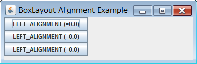
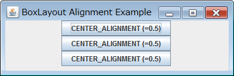
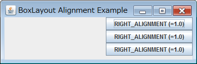
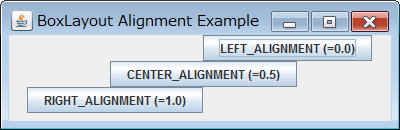

BoxLayout による左寄せ／中央寄せ／右寄せの設定
----

BoxLayout で縦方向にコンポーネントを並べるとき (`BoxLayout.Y_AXIS`)、デフォルトではすべてのコンポーネントは左寄せで配置されます。

これを中央寄せや、右寄せで配置したい場合は、それぞれのコンポーネント (JComponent) の `setAlignmentX()` メソッドで以下のような値を指定します。

- `Component.LEFT_ALIGNMENT` (0.0) -- 左端を別のコンポーネントと合わせる（デフォルト）
- `Component.CENTER_ALIGNMENT` (0.5) -- 中央を別のコンポーネントと合わせる
- `Component.RIGHT_ALIGNMENT` (1.0) -- 右端を別のコンポーネントと合わせる

`setAlignmentX()` を実行しなかった場合の、デフォルトのアライメント位置はコンポーネントごとに異なります。

#### サンプルコード

~~~ java
import java.awt.Component;
import javax.swing.BoxLayout;
import javax.swing.JButton;
import javax.swing.JPanel;

public class MyPanel extends JPanel {
    public MyPanel() {
        setLayout(new BoxLayout(this, BoxLayout.Y_AXIS));
        JButton b1 = new JButton("RIGHT_ALIGNMENT (=1.0)");
        JButton b2 = new JButton("RIGHT_ALIGNMENT (=1.0)");
        JButton b3 = new JButton("RIGHT_ALIGNMENT (=1.0)");
        b1.setAlignmentX(Component.RIGHT_ALIGNMENT);
        b2.setAlignmentX(Component.RIGHT_ALIGNMENT);
        b3.setAlignmentX(Component.RIGHT_ALIGNMENT);
        add(b1);
        add(b2);
        add(b3);
    }
}
~~~

BoxLayout で水平方向にコンポーネントを並べた場合（コンストラクタで `BoxLayout.X_AXIS` を指定した場合）は、`JComponent.setAlignmentY()` で以下のようなパラメータを指定できます。

- `Component.TOP_ALIGNMENT` (0.0) -- 上端を別のコンポーネントと合わせる
- `Component.CENTER_ALIGNMENT` (0.5) -- 中央を別のコンポーネントと合わせる
- `Component.BOTTOM_ALIGNMENT` (1.0) -- 下端を別のコンポーネントと合わせる

BoxLayout の注意点
----

あるコンポーネントで、

~~~ java
button.setAlignmentX(Component.LEFT_ALIGNMENT);
~~~

と指定した場合は、このコンポーネントがそのコンテナの中で左端に表示されるということではないことに注意が必要です。
この指定の意味は、このコンポーネントの左端を、このコンポーネント自体の alignment 位置として設定し、別のコンポーネントの alignment 位置に合わせるように配置するということです。

例えば、３つのボタンの alignment を以下のように設定したとします。

~~~ java
b1.setAlignmentX(Component.LEFT_ALIGNMENT);
b2.setAlignmentX(Component.CENTER_ALIGNMENT);
b3.setAlignmentX(Component.RIGHT_ALIGNMENT);
~~~

すると、ボタン `b1` の左端、ボタン `b2` の中央、ボタン `b3` の右端が同じ位置にくるようにレイアウトされます。

コードと実際の表示が直感的に逆に見えてしまうので、`setAlignmentX()` では端寄せの設定ではなく、あくまでコンポーネント同士の alignment 位置を設定しているのだと理解することが大切です。
Java Tutorial の中では、BoxLayout で alignment を指定する場合には、すべてのコンポーネントに対して同じ値を設定すること推奨しています。

