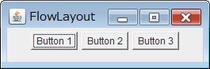

JFrame の content pane と、JPanel にはデフォルトで以下のレイアウトマネージャが設定されています。

- Content pane のデフォルトレイアウトは BorderLayout
- JPanel のデフォルトレイアウトは FlowLayout

Content pane のデフォルトレイアウト
----

#### JFrame の content pane のデフォルトは BorderLayout

#### サンプルコード

~~~ java
Container contentPane = frame.getContentPane();
contentPane.add(new Button("CENTER"));
contentPane.add(new Button("NORTH"), BorderLayout.NORTH);
contentPane.add(new Button("SOUTH"), BorderLayout.SOUTH);
contentPane.add(new Button("EAST"), BorderLayout.EAST);
contentPane.add(new Button("WEST"), BorderLayout.WEST);
~~~

content pane のレイアウトを変更するには、`Container.setLayout()` を使用します。

~~~ java
contentPane.setLayout(new FlowLayout());
~~~

JPanel のデフォルトレイアウト
----

#### JPanel のデフォルトは FlowLayout

#### サンプルコード

~~~ java
JPanel panel = new JPanel();
panel.add(new Button("Button 1"));
panel.add(new Button("Button 2"));
panel.add(new Button("Button 3"));
frame.setContentPane(panel);
~~~

JPanel のレイアウトマネージャを変更するには、コンストラクタで指定します。

~~~ java
JPanel panel = new JPanel(new BorderLayout());
~~~

あるいは、`Container.setLayout()` を使用することもできます。

~~~ java
panel.setLayout(new BorderLayout());
~~~

