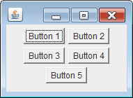

FlowLayout は JPanel のデフォルトのレイアウトマネージャとして設定されており、コンポーネントを単純に左上から右方向に順番に「流れるように」並べていきます。
コンポーネント間には、デフォルトで適度な隙間が入ります。
ウィンドウのサイズを縮めると、内部に配置したコンポーネントは自動的に折り返して並べられます。

#### サンプルコード

~~~ java
public class MyPanel extends JPanel {
    public MyPanel() {
        setLayout(new FlowLayout());
        add(new Button("Button 1"));
        add(new Button("Button 2"));
        add(new Button("Button 3"));
        add(new Button("Button 4"));
        add(new Button("Button 5"));
    }
}
~~~

このレイアウトマネージャでは、大雑把なレイアウトしか行えないので、開発の初期の段階で、とりあえずコンポーネントを配置したいときに使用することになります（動的に増減するボタンを並べる、といった用途には使えるかもしれない）。
最終的なレイアウトでは、別の適切なレイアウトマネージャを設定する必要があります。

