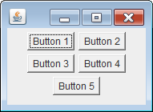
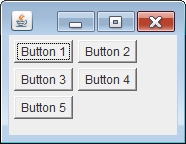

FlowLayout で配置したコンポーネントは、ウィンドウのサイズが縮められると自動的に改行して表示されるようになります。
このとき、デフォルトでは中央寄せで各コンポーネントが並べられるのですが、これを左寄せで表示したい場合は、FlowLayout のコンストラクタで `FlowLayout.LEFT` を指定します。

#### デフォルトは中央寄せ

#### 左寄せ (FlowLayout.LEFT) を設定した場合

#### サンプルコード

~~~ java
public class MyPanel extends JPanel {
    public MyPanel() {
        setLayout(new FlowLayout(FlowLayout.LEFT));  // 左寄せ指定
        add(new Button("Button 1"));
        add(new Button("Button 2"));
        add(new Button("Button 3"));
        add(new Button("Button 4"));
        add(new Button("Button 5"));
    }
}
~~~

