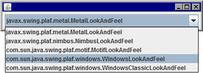

JComboBox は、項目の選択肢をプルダウン表示するためのウィジェットです。

下記のサンプルでは、JComboBox で、Swing のルック＆フィールの一覧を選択できるようにしています（このサンプルでは選択しても何も起きませんが）。

~~~ java
import java.awt.Container;
import java.awt.FlowLayout;
import javax.swing.JComboBox;
import javax.swing.JFrame;
import javax.swing.UIManager;

public class Main {
    public static void main(String[] args) {
        JFrame frame = new JFrame();
        frame.setDefaultCloseOperation(JFrame.EXIT_ON_CLOSE);
        frame.setLayout(new FlowLayout());
        addWidgets(frame.getContentPane());
        frame.pack();
        frame.setVisible(true);
    }

    private static void addWidgets(Container container) {
        // Add combobox to list look and feels
        JComboBox<String> combo = new JComboBox<>();
        UIManager.LookAndFeelInfo[] info = UIManager.getInstalledLookAndFeels();
        for (int i = 0; i < info.length; ++i) {
            combo.addItem(info[i].getClassName());
        }
        container.add(combo);
    }
}
~~~

