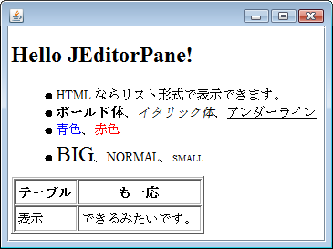

JEditorPane を使用すると、URL で指定した HTML を表示できます。
HTML 形式の文字列を直接渡して表示することもできます。
ただし、JEditorPane は HTML3.2 しか対応していないので、凝ったレイアウトの HTML は表示がくずれてしまいます。

#### JEditorPane のコンストラクタ

~~~ java
JEditorPane()
JEditorPane(String url) throws IOException
JEditorPane(URL initialPage) throws IOException
JEditorPane(String type, String text) throws NullPointerException
~~~

JEditoPane でネット上の HTML を表示する
----

~~~ java
import java.awt.BorderLayout;
import java.awt.Dimension;
import java.io.IOException;

import javax.swing.JEditorPane;
import javax.swing.JPanel;
import javax.swing.JScrollPane;

public class MyPanel extends JPanel {
    private static final long serialVersionUID = 1L;

    public MyPanel() {
        JEditorPane editorPane = null;
        try {
            editorPane = new JEditorPane("http://amazon.co.jp/");
        } catch (IOException e) {
            e.printStackTrace();
            return;
        }

        editorPane.setEditable(false);
        editorPane.setPreferredSize(new Dimension(200, 150));
        JScrollPane scrollPane = new JScrollPane(editorPane);

        setLayout(new BorderLayout());
        add(scrollPane, BorderLayout.CENTER);
    }
}
~~~

JEditorPane で HTML テキストを直接指定して表示する
----

~~~ java
import java.awt.BorderLayout;
import java.awt.Dimension;

import javax.swing.JEditorPane;
import javax.swing.JPanel;
import javax.swing.JScrollPane;

public class MyPanel extends JPanel {
    private static final long serialVersionUID = 1L;
    private static final String HTML =
        "<H1>Hello JEditorPane!</H1>" +
        "<UL>" +
        "<LI>HTML ならリスト形式で表示できます。" +
        "<LI><B>ボールド体</B>、<I>イタリック体</I>、<U>アンダーライン</U>" +
        "<LI>青色、赤色" +
        "<LI><BIG>BIG</BIG>、NORMAL、<SMALL>SMALL</SMALL>" +
        "</UL>" +
        "<TABLE border='1'>" +
        "<TR><TH>テーブル</TH><TH>も一応</TH></TR>" +
        "<TR><TD>表示</TD><TD>できるみたいです。</TD>" +
        "</TABLE>";

    public MyPanel() {
        JEditorPane editorPane = new JEditorPane("text/html", HTML);
        editorPane.setEditable(false);
        editorPane.setPreferredSize(new Dimension(200, 150));
        JScrollPane scrollPane = new JScrollPane(editorPane);

        setLayout(new BorderLayout());
        add(scrollPane, BorderLayout.CENTER);
    }
}
~~~

JEditorPane でローカルの HTML ファイルを表示する
----

JEditorPane でローカルファイルをロードするには、以下のようにしないといけないようです（こうしないと URL がうまく解決できない…）。

~~~ java
// private static final String HTML_FILE = "index.html";

JEditorPane editorPane = new JEditorPane();
editorPane.setContentType("text/html");
editorPane.setPage(new File(HTML_FILE).toURI().toURL());
~~~

