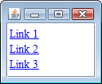

JEditorPane に対して、`HyperlinkListener` を設定すると、ハイパーリンクに関する以下のようなイベントをハンドルできるようになります。

- `HyperlinkEvent.EventType.ENTERED` -- カーソルがリンクの上に入ったとき
- `HyperlinkEvent.EventType.EXITED` -- カーソルがリンクの上から出たとき
- `HyperlinkEvent.EventType.ACTIVATED` -- リンクをクリックしたとき

上記のイベントが発生すると、以下のコールバックが呼び出されます。

~~~
void HyperlinkListener#hyperlinkUpdate(HyperlinkEvent e)
~~~

ここで渡される `HyperlinkEvent` オブジェクトから、以下のような情報を得ることができます。

- `HyperlinkEvent.EventType getEventType()` -- イベントのタイプ (ENTERED / EXITED / ACTIVATED)
- `URL getURL()` -- A タグの href 属性で指定した URL。URL 形式でないときは null。
- `String getDescription()` -- A タグの href 属性で指定したテキストそのまま。

`HyperlinkEvent.getURL()` で取得される URL オブジェクトは、A タグで指定されている href 属性の値が URL の形式（http://～ など）になっていない場合、`null` が返されます。
href 属性をアプリケーション独自の形式で設定する場合は、その値をそのまま返す `HyperlinkEvent.getDescription()` メソッドを使用したほうが都合がよいでしょう。

#### サンプルコード

~~~ java
import java.awt.BorderLayout;
import java.awt.Dimension;
import java.net.URL;

import javax.swing.JEditorPane;
import javax.swing.JPanel;
import javax.swing.JScrollPane;
import javax.swing.event.HyperlinkEvent;
import javax.swing.event.HyperlinkListener;

public class MyPanel extends JPanel {
    private static final long serialVersionUID = 1L;
    private static final String HTML =
        "<A href='link1'>Link 1</A> " +
        "<A href='http://google.com/'>Link 2</A> " +
        "<A href='file:///hoge.txt'>Link 3</A>";

    public MyPanel() {
        JEditorPane editorPane = new JEditorPane("text/html", HTML);
        editorPane.setEditable(false);
        editorPane.setPreferredSize(new Dimension(200, 150));
        editorPane.addHyperlinkListener(new HyperlinkListener() {
            @Override
            public void hyperlinkUpdate(HyperlinkEvent e) {
                HyperlinkEvent.EventType type = e.getEventType();
                URL url = e.getURL();
                String desc = e.getDescription();
                if (HyperlinkEvent.EventType.ENTERED.equals(type)) {
                    System.out.println("ENTERED: url=" + url + ", desc=" + desc);
                } else if (HyperlinkEvent.EventType.EXITED.equals(type)) {
                    System.out.println("EXITED: url=" + url + ", desc=" + desc);
                } else if (HyperlinkEvent.EventType.ACTIVATED.equals(type)) {
                    System.out.println("ACTIVATED: url=" + url + ", desc=" + desc);
                }
            }
        });

        JScrollPane scrollPane = new JScrollPane(editorPane);
        setLayout(new BorderLayout());
        add(scrollPane, BorderLayout.CENTER);
    }
}
~~~

以下のログは、カーソルを Link 1、Link 2、Link 3 と動かしていき、Link 3 の上でリンクをクリックしたときのログです。

~~~
ENTERED: url=null, desc=link1
EXITED: url=null, desc=link1
ENTERED: url=http://google.com/, desc=http://google.com/
EXITED: url=http://google.com/, desc=http://google.com/
ENTERED: url=file:/hoge.txt, desc=file:///hoge.txt
ACTIVATED: url=file:/hoge.txt, desc=file:///hoge.txt
~~~

