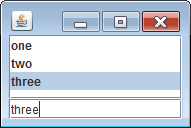

JList 内の項目が選択されたときのイベントをハンドルするには、以下のメソッドで `javax.swing.event.ListSelectionListener` オブジェクトを登録します。

~~~ java
void JList.addListSelectionListener(ListSelectionListener listener)
~~~

項目が選択されたときには、`ListSelectionListener#valueChanged()` が呼び出されます。
このメソッドは、ユーザの選択方法によって複数回呼び出されることがあるので、以下のようにして項目の選択が終了したときのイベントだけを処理するようにしなければいけません。

~~~ java
@Override
public void valueChanged(ListSelectionEvent e) {
    if (e.getValueIsAdjusting()) {
        // The user is still manipulating the selection.
        return;
    }
    // ... 選択された項目を取得 ...
}
~~~

下記のサンプルコードでは、リスト項目が選択されたときに、テキストフィールドに選択された内容を表示します。

~~~ java
import java.awt.BorderLayout;
import javax.swing.JList;
import javax.swing.JPanel;
import javax.swing.JScrollPane;
import javax.swing.JTextField;
import javax.swing.event.ListSelectionEvent;
import javax.swing.event.ListSelectionListener;

public class MyPanel extends JPanel {
    JList list = new JList(new String[]{"one", "two", "three"});
    JTextField textField = new JTextField();

    public MyPanel() {
        setLayout(new BorderLayout());
        JScrollPane scrollPane = new JScrollPane(list);
        list.setLayoutOrientation(JList.VERTICAL);
        list.addListSelectionListener(new ListSelectionListener() {
            @Override
            public void valueChanged(ListSelectionEvent e) {
                if (e.getValueIsAdjusting()) {
                    // The user is still manipulating the selection.
                    return;
                }
                Object obj = list.getSelectedValue();
                if (obj != null) {
                    textField.setText(obj.toString());
                }
            }
        });
        add(scrollPane, BorderLayout.CENTER);
        add(textField, BorderLayout.SOUTH);
    }
}
~~~

