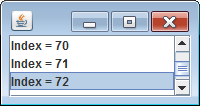

`java.swing.ListModel` インタフェースを実装したクラスを作成すると、そのオブジェクトを JList のモデル（MVC アーキテクチャの M）としてセットすることができるようになります。
`java.swing.ListModel` インタフェースには次のようなメソッドが定義されています。

~~~ java
public interface ListModel<E> {
   int getSize()
   E getElementAt(int index);
   void addListDataListener(ListDataListener l)
   void removeListDataListener(ListDataListener l)
}
~~~

`getSize()` と `getElementAt()` は、リストに格納された要素数や要素への参照を取得するためのメソッドです。
残りの `addListDataListener()` と `removeListDataListener()` は、リストの要素が動的に変更された場合のイベントハンドラを登録／削除するためのメソッドです。

要素を動的に追加／削除しないことが分かっている場合は、`getSize()` と `getElementAt()` を実装するだけで十分です。
そのようなケースでは、`ListModel` インタフェースの空実装を提供する `javax.swing.AbstractListModel` 継承してモデルクラスを作成するとよいでしょう。

~~~ java
public class MyListModel extends AbstractListModel<String> {
    @Override
    public String getElementAt(int index) {
        return "Index = " + index;
    }

    @Override
    public int getSize() {
        return 100;
    }
}

// JList list = new JList(new MyListModel());
~~~

