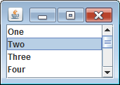

`JList` を使用すると、下記のように項目のリストを表示させることができます。

`JList` のコンストラクタには、以下のいずれかをデータとして渡すことができます。

- `java.swing.ListModel` インタフェース
- `Object[]`
- `Vector<?>`

`JList` で決まった項目を表示するだけなら `Object` の配列か、`Vector` オブジェクトを渡すだけで OK です。
動的に要素を追加、削除することがあるのなら、`ListModel` インタフェースを実装したクラスを用意する必要があります。

`JList` はそれ自身でスクロールの機能を実装していないので、通常は `JScrollPane` に配置してリストをスクロールできるようにします。
以下のサンプルコードでは、固定の要素を持つリストをスクロールできるように `JScrollPane` に配置しています。

~~~ java
import java.awt.BorderLayout;
import javax.swing.JList;
import javax.swing.JPanel;
import javax.swing.JScrollPane;

public class MyPanel extends JPanel {
    private final String[] items = new String[] {
        "One", "Two", "Three", "Four", "Five",
        "Six", "Seven", "Eight", "Nine", "Ten"
    };

    public MyPanel() {
        setLayout(new BorderLayout());
        JList list = new JList(items);
        JScrollPane scrollPane = new JScrollPane(list);
        list.setLayoutOrientation(JList.VERTICAL);
        add(scrollPane, BorderLayout.CENTER);
    }
}
~~~

