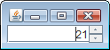
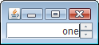

数値を選択するための JSpinner を使用する (SpinnerNumberModel)
----

JSpinner で数値を選択できるようにするには、JSpinner のモデルとして SpinnerNumberModel をセットします。

#### 例: デフォルト値 0

~~~ java
SpinnerNumberModel model = new SpinnerNumberModel();
JSpinner spinner = new JSpinner(model);
~~~

値の取得は以下のようにします。

~~~ java
Integer val = (Integer) model.getValue();
Integer val = (Integer) spinner.getValue();
~~~

任意のリストから選択するための JSpinner を使用する (SpinnerListModel)
----

JSpinner 任意の値のリストから値を取得できるようにするには、JSpinner のモデルとして SpinnerListModel をセットします。

#### 例: String のリストを選択項目としてセットする例

~~~ java
ArrayList<String> list = new ArrayList<String>();
list.add("one");
list.add("two");
list.add("three");

SpinnerListModel model = new SpinnerListModel(list);
JSpinner spinner = new JSpinner(model);
~~~

ここでは、選択項目として String 型のリストを設定したので、選択された値は以下のように String 型で取得します。

~~~ java
String val = (String) model.getValue();
String val = (String) spinner.getValue();
~~~

SpinnerListModel のコンストラクタに、List オブジェクトを渡した場合、そのオブジェクトは内部でコピーされません。
なので、外で List の内容を変更した場合は、JSpinner が表示する内容に反映されます。

SpinnerListModel には、List オブジェクトではなく配列を扱うコンストラクタも用意されており、こちらの場合は内部で List オブジェクトに値がコピーされるので、外部で配列の内容を変更しても JSpinner の表示する項目は変更されません。

~~~ java
String[] array = new String[] {"one", "two", "three"};

SpinnerListModel model = new SpinnerListModel(array);
JSpinner spinner = new JSpinner(model);
~~~

JSpinner で日時を選択する (SpinnerDateModel)
----

JSpinner で日時を選択できるようにするには、JSpinner のモデルとして SpinnerDateModel? をセットします。デフォルト値は現在日時になります。

#### 例: デフォルトフォーマット

~~~ java
SpinnerDateModel model = new SpinnerDateModel();
JSpinner spinner = new JSpinner(model);
~~~

#### 例: 任意の日付フォーマットを指定する

~~~ java
SpinnerDateModel model = new SpinnerDateModel();
JSpinner spinner = new JSpinner(model);
JComponent editor = new JSpinner.DateEditor(spinner, "yyyy-MM-dd HH:mm:ss");
spinner.setEditor(editor);
~~~

設定された日時は、以下のように Date オブジェクトとして取得します。

~~~ java
Date date = (Date) spinner.getValue();
Date date = (Date) model.getValue();
~~~

JSpinner で扱う数値の初期値、最小値、最大値、ステップ幅を設定する。
----

JSpinner で扱う値のデフォルト設定は以下のようになっています。

- 初期値: 0
- 最小値: 制限なし（実際には `Integer.MIN_VALUE` (-2,147,483,648)）
- 最大値: 制限なし（実際には `Integer.MAX_VALUE` (2,147,483,647)）
- ステップ幅: 1

これを変更するには以下のようにします。

~~~ java
SpinnerNumberModel model = new SpinnerNumberModel();
model.setValue(50);     // 初期値
model.setMinimum(0);    // 選択可能な最小値
model.setMaximum(100);  // 選択可能な最大値
model.setStepSize(10);  // ステップ幅
JSpinner spinner = new JSpinner(model);
~~~

コンストラクタでも指定できます。

~~~ java
SpinnerNumberModel model = new SpinnerNumberModel(50, 0, 100, 10);
JSpinner spinner = new JSpinner(model);
~~~

SpinnerNumberModel で、double 型のパラメータを扱うコンストラクタを呼び出すと、浮動小数点数を扱うことができます。

~~~ java
SpinnerNumberModel model = new SpinnerNumberModel(5, 0, 10, 0.25);
JSpinner spinner = new JSpinner(model);
~~~

SpinnerNumberModel に Double 値を設定する場合は、`model.getValue()` で取得するオブジェクトを、Integer 型ではなく、Double 型で扱う必要があります。

JSpinner で選択されている値を取得する
----

JSpinner で選択中の項目を取得するには、JSpinner あるいは、セットした SpinnerModel の `getValue()` メソッドを使用します。

~~~ java
Object JSpinner.getValue()
Object SpinnerModel.getValue()
~~~

で現在選択中の項目を取得することができます。
実際に返される Object は、ListModel の `getValue()` で返しているオブジェクトによって決まります。

例えば、SpinnerNumberModel を JSpinner のモデルとしてセットしている場合は、`getValue()` で返されるオブジェクトの型は Interger あるいは Double になります。

~~~ java
SpinnerNumberModel model = new SpinnerNumberModel();
JSpinner spinner = new JSpinner(model);
Integer val = (Integer) spinner.getValue();
~~~

JSpinner の選択項目が変更されたときのイベントをハンドルする
----

JSpinner に ChangeListener を登録することで、選択項目が変更されたときのイベントをハンドルできます。

このイベントは、以下のような操作を行ったときに発生します。

- Spinner の上下ボタンを押して値が変わったとき。
- キーボードの上下キーを押してで値が変わったとき。
- キーボードから値を直接入力して Enter キーを押したとき。

~~~ java
// import javax.swing.JSpinner;
// import javax.swing.SpinnerNumberModel;
// import javax.swing.event.ChangeEvent;
// import javax.swing.event.ChangeListener;

SpinnerNumberModel model = new SpinnerNumberModel();
JSpinner spinner = new JSpinner(model);
ChangeListener listener = new ChangeListener() {
    @Override
    public void stateChanged(ChangeEvent e) {
        JSpinner spinner = (JSpinner) e.getSource();
        Integer val = (Integer) spinner.getValue();
        System.out.println(val);
    }
};
spinner.addChangeListener(listener);
~~~

JSpinner に数値以外の値を設定できないようにする
----

デフォルトではキーボードから値を入力すると、JSpinner に無効な値も入力できてしまいます（値変更のイベントは発生しませんが）。
無効な値の入力を禁止するには以下のようにします。

~~~ java
SpinnerNumberModel model = new SpinnerNumberModel();
JSpinner spinner = new JSpinner(model);
disableInvalidInput(spinner);

private void disableInvalidInput(JSpinner spinner) {
    JSpinner.DefaultEditor editor =
        (JSpinner.DefaultEditor) spinner.getEditor();
    DefaultFormatter formatter =
        (DefaultFormatter) editor.getTextField().getFormatter();
    formatter.setAllowsInvalid(false);
}
~~~

