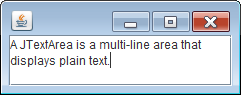

複数行のテキストを表示したり編集したりする場合は、JTextArea を使用します（１行だけの表示でよい場合は、JTextField を使用します）。

JTextArea 単体では、スクロール機能を備えていないので、通常は JScrollPane の上に JTextArea を配置して使用します。

#### サンプルコード

~~~ java
import java.awt.BorderLayout;
import javax.swing.JPanel;
import javax.swing.JScrollPane;
import javax.swing.JTextArea;

public class MyPanel extends JPanel {
    public MyPanel() {
        JTextArea textArea = new JTextArea(3, 20);
        JScrollPane scrollPane = new JScrollPane(textArea);

        setLayout(new BorderLayout());
        add(scrollPane, BorderLayout.CENTER);
    }
}
~~~

