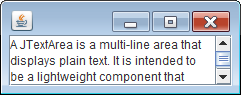

JTextArea にセットしたテキストは、デフォルトでは画面端で折り返しを行いません。
自動的に画面端でテキストを折り返すようにするには以下のメソッドを使用します。

~~~ java
void JTextArea.setLineWrap(boolean wrap)
void JTextArea.setWrapStyleWord(boolean word)
~~~

`setLineWrap(true)` とすると、画面端でテキストを折り返すようになり、さらに `setWrapStyleWord(true)` とすると、単語単位でテキストを折り返すようになります。

#### サンプルコード

~~~ java
import java.awt.BorderLayout;
import javax.swing.JPanel;
import javax.swing.JScrollPane;
import javax.swing.JTextArea;

public class MyPanel extends JPanel {
    public MyPanel() {
        JTextArea textArea = new JTextArea(3, 20);
        textArea.setLineWrap(true);
        textArea.setWrapStyleWord(true);

        JScrollPane scrollPane = new JScrollPane(textArea);
        setLayout(new BorderLayout());
        add(scrollPane, BorderLayout.CENTER);
    }
}
~~~

