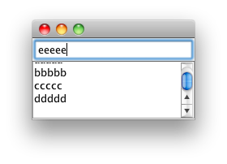

`JTextField` 上での `Enter` キーの入力をハンドルするには、`ActionListener` を設定します。
以下のサンプルでは、上部に表示された `JTextField` に任意のテキストを入力し、`Enter` キーを押したとき、その内容を下部の `JTextArea` に表示するようにしています。

#### MyPanel.java

~~~ java
import java.awt.BorderLayout;
import java.awt.Dimension;
import java.awt.event.ActionEvent;
import java.awt.event.ActionListener;
import javax.swing.JPanel;
import javax.swing.JScrollPane;
import javax.swing.JTextArea;
import javax.swing.JTextField;

@SuppressWarnings("serial")
public class MyPanel extends JPanel {
    private JTextField textInput = new JTextField();
    private JTextArea textOutput = new JTextArea();

    public MyPanel() {
        initComponents();
        setPreferredSize(new Dimension(200, 100));
    }

    private void initComponents() {
        // Initialize each component.
        textInput.addActionListener(enterActionListener);
        textOutput.setEditable(false);

        // Layout.
        JScrollPane scrollPane = new JScrollPane(textOutput);
        setLayout(new BorderLayout());
        add(textInput, BorderLayout.NORTH);
        add(scrollPane, BorderLayout.CENTER);
    }

    private ActionListener enterActionListener = new ActionListener() {
        @Override
        public void actionPerformed(ActionEvent e) {
            textOutput.append(textInput.getText() + "\n");
            textInput.setText("");
        }
    };
}
~~~

#### Main.java

~~~ java
import javax.swing.JFrame;

public class Main {
    public static void main(String[] a) {
        JFrame frame = new JFrame();
        frame.setContentPane(new MyPanel());
        frame.pack();
        frame.setDefaultCloseOperation(JFrame.EXIT_ON_CLOSE);
        frame.setVisible(true);
    }
}
~~~

