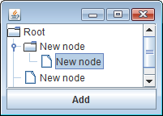

JTree に対して動的にノードを追加するには、JTree にセットした TreeModel に対してツリーノードを追加していくのが一般的です。
TreeModel はインタフェースであり、その具象クラスでは、以下のインタフェースを実装しなければいけません。

~~~
void TreeModel#addTreeModelListener(TreeModelListener l)
void TreeModel#removeTreeModelListener(TreeModelListener l)
~~~

TreeModel の保持する要素が（ノードの追加などで）変更された場合、TreeModel に登録された TreeModelListener に対して、適切なメッセージを送るように実装する必要があります。
JTree はこのメッセージを受け取ることによって、ツリーノードの追加時に自動的に自分自身を再描画することができます。

TreeModel の各メソッドを実装するのは面倒なので、あらかじめ DefaultTreeModel というクラスが提供されています。
DefaultTreeModel は、ツリーノードとして MutableTreeNode を保持できるようになっており、TreeModel のインタフェースの `addTreeModelListener()` も実装しています。

DefaultTreeModel の保持するツリーノードを変更する際に、以下のようなメソッドを使用することで、登録された TreeModelListener に対して適切にメッセージが送られるようになっています。

~~~ java
void insertNodeInto(MutableTreeNode newChild, MutableTreeNode parent, int index)
void removeNodeFromParent(MutableTreeNode node)
void nodeChanged(TreeNode node)
~~~

以下の例では、JTree のデータモデルとして DefaultTreeModel を設定し、動的にその内容を変更します。Add ボタンを押すと、現在選択されているノードの下に、新しく子ノードを追加します。

~~~ java
import java.awt.BorderLayout;
import java.awt.event.ActionEvent;
import java.awt.event.ActionListener;
import javax.swing.JButton;
import javax.swing.JPanel;
import javax.swing.JScrollPane;
import javax.swing.JTree;
import javax.swing.tree.DefaultMutableTreeNode;
import javax.swing.tree.DefaultTreeModel;
import javax.swing.tree.TreePath;

@SuppressWarnings("serial")
public class MyPanel extends JPanel {
    private DefaultTreeModel treeModel;
    private JTree tree;

    public MyPanel() {
        DefaultMutableTreeNode rootNode = new DefaultMutableTreeNode("Root");
        treeModel = new DefaultTreeModel(rootNode);
        tree = new JTree(treeModel);

        JButton addButton = new JButton("Add");
        addButton.addActionListener(new ActionListener() {
            @Override
            public void actionPerformed(ActionEvent e) {
                addNewNode();
            }
        });

        setLayout(new BorderLayout());
        add(new JScrollPane(tree), BorderLayout.CENTER);
        add(addButton, BorderLayout.SOUTH);
    }

    private void addNewNode() {
        DefaultMutableTreeNode parent = getSelectedNode(tree);
        DefaultMutableTreeNode newChild = new DefaultMutableTreeNode("New node");
        treeModel.insertNodeInto(newChild, parent, parent.getChildCount());
        selectNode(tree, newChild);
    }

    //---- utility methods ----

    // [TreeUtil]
    /**
     * Make sure the user can see a specified node.
     */
    private void selectNode(JTree tree, DefaultMutableTreeNode node) {
        TreePath path = new TreePath(node.getPath());
        tree.setSelectionPath(path);
    }

    // [TreeUtil]
    /**
     * Returns a selected node of a tree.
     * If there is no selection, the root node is returned.
     */
    private DefaultMutableTreeNode getSelectedNode(JTree tree) {
        DefaultMutableTreeNode node = null;
        TreePath treePath = tree.getSelectionPath();
        if (treePath == null) {
            node = (DefaultMutableTreeNode) tree.getModel().getRoot();
        } else {
            node = (DefaultMutableTreeNode) treePath.getLastPathComponent();
        }
        return node;
    }
}
~~~

