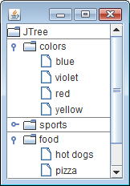

JTree オブジェクトに対して、以下のようにプロパティ設定を行うと、第一階層（ルートノードの直下）のノード間にラインを表示することができます。

~~~ java
UIManager.put("Tree.line", Color.GRAY);
JTree tree = new JTree();
tree.putClientProperty("JTree.lineStyle", "Horizontal");
~~~

ただし、選択しているルック＆フィールによっては、ラインが描画されないこともあります。

