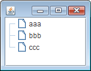
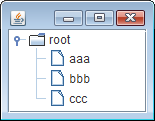

配列 (Object[])、Vector、Hashtable から JTable を作成した場合、デフォルトではルートノードは非表示になっています。
ルートノードを表示する場合は、`JTree#setRootVisible(boolean rootVisible)` で `true` を指定します。

~~~ java
tree.setRootVisible(true);
~~~

逆に、JTree のコンストラクタで TreeNode や TreeModel を指定した場合は、デフォルトでルートノードが表示されるようになっています。
その場合、ルートノードを表示しないようにするには、明示的に `false` を設定する必要があります。

