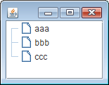

JTree のコンストラクタの種類
----

JTree には下記のようなコンストラクタが用意されています。

- `JTree()` -- 後から `setModel(TreeModel newModel)` でデータをセットする。
- `JTree(Object[] value)`
- `JTree(Vector<?> value)`
- `JTree(Hashtable<?,?> value)`
- `JTree(TreeModel newModel)`
- `JTree(TreeNode root)`
- `JTree(TreeNode root, boolean asksAllowsChildren)`

配列、Vector、Hashtable から JTree を作成する
----

配列を JTree のコンストラクタに渡す場合は、配列の入れ子構造を作成すれば、多階層のツリーを作成することができます。
ただし、各オブジェクトの `toString()` メソッドの結果がノードのラベルとして表示されてしまうので、自身が配列オブジェクトとなるノードは、`[L.java.lang.Object;@1050e1f` のようなラベルで表示されてしまいます。

~~~ java
import java.awt.BorderLayout;
import javax.swing.JPanel;
import javax.swing.JScrollPane;
import javax.swing.JTree;

public class MyPanel extends JPanel {
    private static final long serialVersionUID = 1L;

    public MyPanel() {
        Object[] arr = new Object[] {
                "aaa", "bbb", "ccc",
                new Object[] {100, 200, 300},
                System.getProperties()
        };
        JTree tree = new JTree(arr);

        JScrollPane scrollPane = new JScrollPane(tree);
        setLayout(new BorderLayout());
        add(scrollPane, BorderLayout.CENTER);
    }
}
~~~

Vector から JTree を作成する場合も、ほぼ同様に作成できます。

~~~ java
Vector<String> vec = new Vector<String>();
vec.add("aaa");
vec.add("bbb");
vec.add("ccc");
JTree tree = new JTree(vec);
~~~

Hashtable から JTree を作成する場合は、Hashtable のキーだけがノードとして表示されます。

~~~ java
Hashtable<String, Integer> table = new Hashtable<String, Integer>();
table.put("aaa", 100);
table.put("bbb", 200);
table.put("ccc", 300);
JTree tree = new JTree(table);
~~~

TreeNode から JTree を作成する
----

JTree のコンストラクタでルートノードとなる TreeNode オブジェクトを指定することでも、
JTree をインスタンス化できます。
TreeNode は実際には親ノードや子ノードを取得するためのメソッドを定義したインタフェースであり、これを実装した DefaultMutableTreeNode クラスを使用することで簡単にツリーを構成できます。

DefaultMutableTreeNode のコンストラクタは任意のオブジェクトをパラメータとして受け取り、JTree はこのオブジェクトの `toString()` が返した文字列を各ノードに表示します。
DefaultMutableTreeNode クラスには、子ノードとなる `add()` メソッドが定義されており、このメソッドを使って、階層構造を作ることができます。

~~~ java
import java.awt.BorderLayout;
import javax.swing.JPanel;
import javax.swing.JScrollPane;
import javax.swing.JTree;
import javax.swing.tree.DefaultMutableTreeNode;
import javax.swing.tree.TreeNode;

@SuppressWarnings("serial")
public class MyPanel extends JPanel {
    public MyPanel() {
        JTree tree = new JTree(createNodes());
        JScrollPane scrollPane = new JScrollPane(tree);
        setLayout(new BorderLayout());
        add(scrollPane, BorderLayout.CENTER);
    }

    private class Person {
        private String name;
        public Person(String name) { this.name = name; }
        @Override public String toString() { return name; }
    }

    private TreeNode createNodes() {
        // Create nodes.
        DefaultMutableTreeNode top = new DefaultMutableTreeNode("Top");
        DefaultMutableTreeNode work = new DefaultMutableTreeNode("Work");
        DefaultMutableTreeNode priv = new DefaultMutableTreeNode("Private");
        DefaultMutableTreeNode p1 = new DefaultMutableTreeNode(new Person("Name 1"));
        DefaultMutableTreeNode p2 = new DefaultMutableTreeNode(new Person("Name 2"));
        DefaultMutableTreeNode p3 = new DefaultMutableTreeNode(new Person("Name 3"));
        DefaultMutableTreeNode p4 = new DefaultMutableTreeNode(new Person("Name 4"));
        DefaultMutableTreeNode p5 = new DefaultMutableTreeNode(new Person("Name 5"));
        DefaultMutableTreeNode p6 = new DefaultMutableTreeNode(new Person("Name 6"));

        // Construct a hierarchy.
        top.add(work);
        top.add(priv);
        work.add(p1);
        work.add(p2);
        work.add(p3);
        priv.add(p4);
        priv.add(p5);
        priv.add(p6);

        return top;
    }
}
~~~

