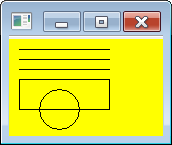

SWT で任意の図形を描画するには、Canvas オブジェクトを作成し、そこに GC (graphic context) オブジェクトで描画していきます。

#### クラス階層

~~~
org.eclipse.swt.widgets.Widget
└ org.eclipse.swt.widgets.Control
   └ org.eclipse.swt.widgets.Scrollable
      └ org.eclipse.swt.widgets.Composite
         └ org.eclipse.swt.widgets.Canvas
~~~

#### Canvas コンストラクタ

~~~ java
public Canvas(Composite parent, int style)
~~~

Canvas クラスは Composite クラスを継承しているため、Composite と同様にこのクラスを継承して独自の Canvas クラスを作っておけば、上位の Composite オブジェクト（例えば Shell）に対して簡単に配置することができます。

Canvas オブジェクトに描画するための GC オブジェクトは、GC クラスのコンストラクタを直接呼び出して作成することもできますが、そのようにして作成した GC オブジェクトを使って描画した絵は、ウィンドウの陰に隠れたときに消えてしまします。

#### GC コンストラクタ

~~~ java
public GC(Drawable drawable)
~~~

適切な再描画処理を実行させるには、`PaintListener#paintControl(PaintEvent)` を実装した PaintListener オブジェクトを、Canvas に対してセットしてやります。
再描画が必要なタイミングで自動的に `paintControl` メソッドが呼び出されるので、そこで渡される PaintEvent オブジェクトから GC オブジェクトを取得して描画するように実装します。

#### サンプルコード

~~~ java
import org.eclipse.swt.SWT;
import org.eclipse.swt.events.PaintEvent;
import org.eclipse.swt.events.PaintListener;
import org.eclipse.swt.graphics.GC;
import org.eclipse.swt.widgets.Canvas;
import org.eclipse.swt.widgets.Composite;

public class MyCanvas extends Canvas {
    public MyCanvas(Composite parent) {
        super(parent, SWT.NONE);
        setBackground(this.getDisplay().getSystemColor(SWT.COLOR_YELLOW));
        addPaintListener(paintListener);
    }

    private PaintListener paintListener = new PaintListener() {
        @Override
        public void paintControl(PaintEvent pe) {
            GC gc = pe.gc;
            gc.drawLine(10, 10, 100, 10);
            gc.drawLine(10, 20, 100, 20);
            gc.drawLine(10, 30, 100, 30);
            gc.drawRectangle(10, 40, 90, 30);
            gc.drawOval(30, 50, 40, 40);
        }
    };
}
~~~

