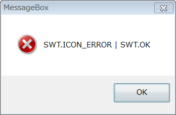
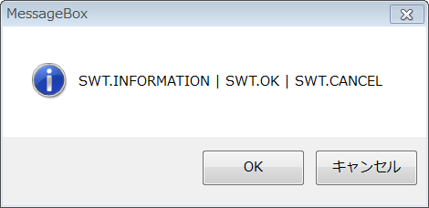
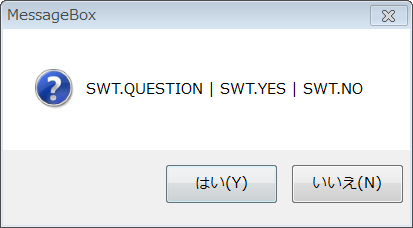
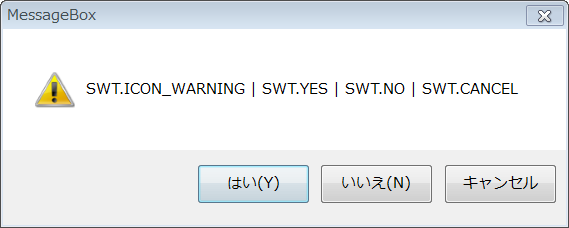
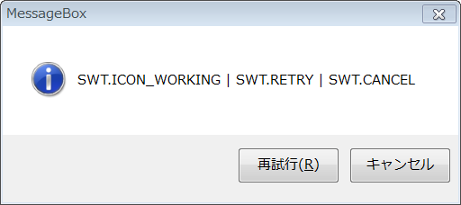
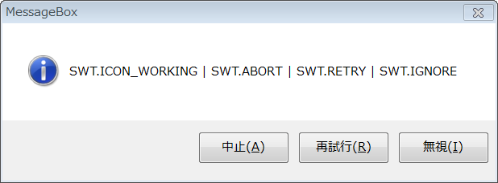

SWT に用意されている MessageBox の種類
----

SWT の org.eclipse.swt.widgets.MessageBox クラスを使うと、いろいろなダイアログを表示することができます。

- [Javadoc: org.eclipse.swt.widgets.MessageBox](http://help.eclipse.org/helios/topic/org.eclipse.platform.doc.isv/reference/api/org/eclipse/swt/widgets/MessageBox.html)

どのような種類のダイアログを表示するかは、コンストラクタでアイコンの種類と、ボタンの種類を渡して指定します。

- アイコンの種類（いずれかひとつ）
  - `SWT.ICON_ERROR`
  - `SWT.ICON_INFORMATION`
  - `SWT.ICON_QUESTION`
  - `SWT.ICON_WARNING`
  - `SWT.ICON_WORKING`
- ボタンの種類（下記の組み合わせいずれかひとつ）
  - `SWT.OK`
  - `SWT.OK│SWT.CANCEL`
  - `SWT.YES│SWT.NO`
  - `SWT.YES│SWT.NO│SWT.CANCEL`
  - `SWT.RETRY│SWT.CANCEL`
  - `SWT.ABORT│SWT.RETRY│SWT.IGNORE`

### ERROR アイコンの例

~~~ java
MessageBox msgBox = new MessageBox(shell, SWT.ICON_ERROR | SWT.OK);
msgBox.setText("MessageBox");
msgBox.setMessage("SWT.ICON_ERROR | SWT.OK");
int reply = msgBox.open();
~~~

### INFORMATION アイコンの例

~~~ java
MessageBox msgBox2 = new MessageBox(shell, SWT.ICON_INFORMATION | SWT.OK | SWT.CANCEL);
msgBox2.setText("MessageBox");
msgBox2.setMessage("SWT.INFORMATION | SWT.OK | SWT.CANCEL");
int reply = msgBox2.open();
~~~

### QUESTION アイコンの例

~~~ java
MessageBox msgBox3 = new MessageBox(shell, SWT.ICON_QUESTION | SWT.YES | SWT.NO);
msgBox3.setText("MessageBox");
msgBox3.setMessage("SWT.QUESTION | SWT.YES | SWT.NO");
int reply = msgBox3.open();
~~~

### WARNING アイコンの例

~~~ java
MessageBox msgBox4 = new MessageBox(shell, SWT.ICON_WARNING | SWT.YES | SWT.NO | SWT.CANCEL);
msgBox4.setText("MessageBox");
msgBox4.setMessage("SWT.ICON_WARNING | SWT.YES | SWT.NO | SWT.CANCEL");
int reply = msgBox4.open();
~~~

### WORKING アイコンの例

~~~ java
MessageBox msgBox = new MessageBox(shell, SWT.ICON_WORKING | SWT.RETRY | SWT.CANCEL);
msgBox.setText("MessageBox");
msgBox.setMessage("SWT.ICON_WORKING | SWT.RETRY | SWT.CANCEL");
int reply = msgBox.open();
~~~

※ Windows Vista では `SWT.ICON_INFORMATION` と `SWT.ICON_WORKING` のアイコンは同じみたいです。

### WORKING アイコンの例 (2)

~~~ java
MessageBox msgBox = new MessageBox(shell, SWT.ICON_WORKING | SWT.ABORT | SWT.RETRY | SWT.IGNORE);
msgBox.setText("MessageBox");
msgBox.setMessage("SWT.ICON_WORKING | SWT.ABORT | SWT.RETRY | SWT.IGNORE");
int reply = msgBox.open();
~~~

MessageBox で押されたボタンを調べる
----

`MessageBox#open()` は、押されたボタンの値を `int` 値で返します。
この値は、表示するボタンの種類を決めるときに指定するのと同じ `SWT.YES` や `SWT.NO` などの値です。

~~~ java
MessageBox msgBox = new MessageBox(shell, SWT.ICON_INFORMATION | SWT.OK | SWT.CANCEL);
msgBox.setMessage("Do you wish to continue?");
int reply = msgBox.open();
if (reply != SWT.OK) {
    return;
}
~~~

MessageBox を簡単に使うためのクラス
----

下記のような MsgBox クラスを作成しておけば、MessageBox の表示を、

~~~ java
MsgBox.show("Hello!");
~~~

のように簡単に実行できるようになります。

#### MsgBox.java

~~~ java
import org.eclipse.swt.widgets.MessageBox;
import org.eclipse.swt.widgets.Shell;
import org.eclipse.swt.SWT;

public final class MsgBox {
    static private MessageBox msg = new MessageBox(new Shell(), SWT.NULL);

    public static void show(String message) {
        msg.setMessage(message);
        msg.open();
    }

    public static void show(String title, String message) {
        msg.setText(title);
        msg.setMessage(message);
        msg.open();
    }
}
~~~

