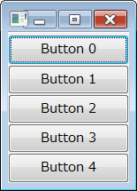
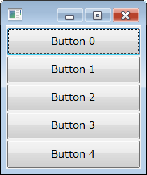
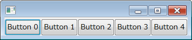
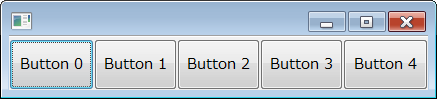
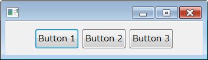

ウィジェットを縦／横に等間隔に並べる
----

Composite に FillLayout を設定すると、その Composite に対して追加されるウィジェットが縦一列 (`SWT.VERTICAL`)、あるいは横一列 (`SWT.HORIZONTAL`) に等間隔で配置されます。

#### SWT.VERTICAL

#### SWT.HORIZONTAL

配置したウィジェットは親 Composite 全体を占めるように引き延ばされます。
ウィンドウサイズ（親 Composite のサイズ）を変更すると、それぞれのウィジェットのサイズが自動的に等間隔になるよう伸縮されます。

- FillLayout のコンストラクタ: `org.eclipse.swt.layout.FillLayout.FillLayout(int type)`
- Composite の Layout 設定用メソッド: `void org.eclipse.swt.widgets.Composite.setLayout(Layout layout)`

#### サンプルコード

~~~ java
import org.eclipse.swt.SWT;
import org.eclipse.swt.layout.FillLayout;
import org.eclipse.swt.widgets.Button;
import org.eclipse.swt.widgets.Composite;

public class MyComposite extends Composite {
    MyComposite(Composite parent) {
        super(parent, SWT.NONE);

        setLayout(new FillLayout(SWT.VERTICAL));
        for (int i = 0; i < 5; ++i) {
            Button btn = new Button(this, SWT.None);
            btn.setText("Button " + i);
        }
    }
}
~~~

FillLayout の各種マージンを設定する
----

FillLayout オブジェクトの下記フィールドを設定することで、各種マージンを設定することができます。

- `marginHeight` -- Composite の左端、右端からのマージン
- `marginWidth` -- Composite の上端、下端からのマージン
- `spacing` -- 配置したウィジェット同士の間隔

#### サンプルコード

~~~ java
import org.eclipse.swt.SWT;
import org.eclipse.swt.layout.FillLayout;
import org.eclipse.swt.widgets.Button;
import org.eclipse.swt.widgets.Composite;

public class MyComposite extends Composite {
    MyComposite(Composite parent) {
        super(parent, SWT.NONE);

        FillLayout layout = new FillLayout(SWT.HORIZONTAL);
        layout.marginHeight = 10;  // Composite の左端、右端からのマージン
        layout.marginWidth = 50;   // Composite の上端、下端からのマージン
        layout.spacing = 5;        // 配置したウィジェット同士の間隔
        setLayout(layout);

        for (int i = 0; i < 3; ++i) {
            Button btn = new Button(this, SWT.None);
            btn.setText("Button " + (i + 1));
        }
    }
}
~~~

