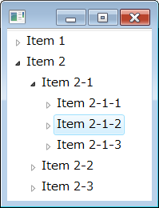

Tree (SWT) と TreeViewer (JFace) の違い
----

ツリーを構成するために SWT の `org.eclipse.swt.widgets.Tree` を使用すると、ひとつずつノードを追加していくコードが必要になります。
JFace が提供する `org.eclipse.jface.viewers.TreeViewer` を使用すると、MVC (Model-View-Controller) アーキテクチャに基づいたコーディングが可能です。
Model に相当する Provider インタフェースを実装し、これを TreeViewer にセットするだけで、ツリーを表示してくれます。

Provider には、データを表す ContentProvider と、表示する文字列や、アイコンを表す LabelProvider があります。
TreeViewer には以下の２種類の Provider を実装してセットします。

~~~ java
org.eclipse.jface.viewers.ILabelProvider;
org.eclipse.jface.viewers.ITreeContentProvider;
~~~

それぞれの Provider インタフェースをセットするには、以下のメソッドを使用します。
`setLableProvider()` を実行しなかった場合は、デフォルトで各ノードに対応する Object の `toString()` の結果が表示テキストとして使用されます。

~~~ java
setLabelProvider(IBaseLabelProvider provider)
setContentProvider(IContentProvider provider)
~~~

TreeViewer ではなく、Tree を使うことの欠点として以下のようなことが挙げられます。

- TreeItem を１つだけ削除したいとき、まず `removeAll` してツリーを１から再構成する必要がある。これは、TreeItem が親ノードや、子ノードの参照を持っていて、単純に一か所のノードを削除すると、関連がぐちゃぐちゃになってしまうから。
- 各ノードの表示テキストを変更したい場合も、ツリーを１から再構築する必要がある。

一方、TreeViewer を使っていれば、データが更新されたときに `TreeViewer.refresh()` を実行するだけでよいし、各ノードの表示方法を変更したいときは ILabelProvider をセットし直すだけで済みます。

TreeViewer を使ってみる
----

まず、TreeViewer に表示するための、データとなる ContentProvider を作成します。
ITreeContentProvider インタフェースの提供する以下の API を実装する必要があります。

Object[] getChildren(Object parentElement)
: あるノードを展開するときに呼び出される。選択したノードに対応するオブジェクトが渡されるので、子ノードの配列を返すように実装する。

Object getParent(Object element)
: 渡されたノードの親ノードに対応するオブジェクトを返すように実装する。親ノードが存在しない（ルートノード）の場合は null を返すように実装する。ノードの展開とかで使われるらしいけど、詳細は不明。

boolean hasChildren(Object parentElement)
: パラメータで渡されたノードに子ノードが存在するなら `true` を返すように実装する。ここで `true` が返されたノードは展開できるようになる。

Object[] getElements(Object inputElement)
: ツリーのルートノードを表すオブジェクトの配列を返すように実装する。パラメータには、`TreeView.setInput()` で渡されたオブジェクトが渡される。

void dispose()
: この ContentProvider で割り当てたリソースを破棄するように実装する。TreeView が破棄されるときに呼び出される。破棄するリソースが何もない場合は、実装は空でよい。

void inputChanged(Viewer viewer, Object oldInput, Object newInput)
: `TreeView.setInput()` で TreeView にセットされたデータが変更されるときに呼び出される。最初に `setInput()` を呼び出した際にも呼び出される。このとき、`oldInput` は `null` になり、`newInput` には `setInput()` に渡したデータと同じものが渡される。このメソッドは TreeView が破棄される直前にも呼び出される。このとき、`newInput` は `null` になる。データが変更されたときにすることが何もない場合は、実装は空でよい。

ここでは、以下のようなダミーのツリー構造を表す ContentProvider を作成してみます。
子ノードのリストは `getChildren()` の中で、親ノードの名前をもとに動的に作成するようにしているので、階層は無限になっています。

#### DummyContentProvider.java

~~~ java
import org.eclipse.jface.viewers.ITreeContentProvider;
import org.eclipse.jface.viewers.Viewer;

public class DummyContentProvider implements ITreeContentProvider {
    @Override
    public Object[] getChildren(Object parentElement) {
        String prefix = parentElement.toString();
        return new Object[] {
                prefix + "-1",
                prefix + "-2",
                prefix + "-3" };
    }

    @Override
    public Object getParent(Object element) {
        return null;
    }

    @Override
    public boolean hasChildren(Object parentElement) {
        return true;
    }

    @Override
    public Object[] getElements(Object inputElement) {
        return new Object[] { "Item 1", "Item 2" };
    }

    @Override
    public void dispose() {}

    @Override
    public void inputChanged(Viewer viewer, Object oldInput, Object newInput) {}
}
~~~

この ContentProvider を TreeViewer で表示するための Composite クラスは以下のようになります。

#### MyComposite.java

~~~ java
import org.eclipse.jface.viewers.TreeViewer;
import org.eclipse.swt.SWT;
import org.eclipse.swt.layout.FillLayout;
import org.eclipse.swt.widgets.Composite;

public class MyComposite extends Composite {
    MyComposite(Composite parent) {
        super(parent, SWT.NONE);
        addComponents();
    }

    private void addComponents() {
        setLayout(new FillLayout(SWT.HORIZONTAL));
        TreeViewer treeViewer = new TreeViewer(this, SWT.SINGLE);
        treeViewer.setContentProvider(new DummyContentProvider());
        treeViewer.setInput("dummy");
    }
}
~~~

ここではダミーデータを表示しているので、`TreeViewer#setInput()` で渡すデータは何でもよいのですが、`null` 以外のデータを渡さないとツリーに何も表示されないので、とりあえず適当な文字列 `"dummy"` を渡しています。
`TreeViewer#setInput()` を実行すると、ContentProvider の下記のメソッドが呼ばれます。

~~~ java
Object[] getElements(Object element)
~~~

このメソッドで、ツリーのルート要素として表示する要素の配列を返すように実装しておく必要があります。

TreeViewer 上のアイテムを選択したときのイベントをハンドルする
----

TreeViewer や ListViewer で現在選択されているアイテムを取得するには、StructuredViewer の提供する `getSelection()` メソッドを使用します。

~~~ java
IStructuredSelection selection = (IStructuredSelection) viewer.getSelection();
~~~

IStructuredSelection オブジェクトを取得したら、`iterator()` メソッドで Iterator オブジェクトを取得して、選択されたアイテムを順に取得していくことができます。

~~~ java
Iterator it = selection.iterator();
~~~

下記の例では、TreeViewer や ListViewer の選択状態が変更されたことを調べるために、`addSelectionChangedListener()` メソッドで ISelectionChangedListener オブジェクトを登録しています。
`selectionChanged()` イベントで渡される SelectionChangedEvent オブジェクトからも IStructuredSelection オブジェクトを取得することができます。

~~~ java
// import java.util.Iterator;
// import org.eclipse.jface.viewers.ISelectionChangedListener;
// import org.eclipse.jface.viewers.IStructuredSelection;
// import org.eclipse.jface.viewers.SelectionChangedEvent;

treeViewer.addSelectionChangedListener(new ISelectionChangedListener() {
    @Override
    public void selectionChanged(SelectionChangedEvent e) {
        IStructuredSelection selection = (IStructuredSelection) e.getSelection();
        for (Iterator<MyTreeItem> it = selection.iterator(); it.hasNext(); ) {
            MyTreeItem item = it.next();
            System.out.println(item.getName());
        }
    }
});
~~~

ツリーノードを 展開したときイベントをハンドルする
----

TreeViewer のツリーノードを閉じたり開いたりするときのイベントをハンドルするには、`addTreeListener()` メソッドを使用して、ITreeViewerListener オブジェクトをセットします。

~~~ java
// import org.eclipse.jface.viewers.ITreeViewerListener;
// import org.eclipse.jface.viewers.TreeExpansionEvent;

treeViewer.addTreeListener(new ITreeViewerListener() {
    @Override
    public void treeCollapsed(TreeExpansionEvent event) {
    }

    @Override
    public void treeExpanded(TreeExpansionEvent event) {
    }
});
~~~

