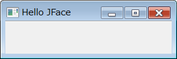

ウィンドウのタイトルを取得するには、ApplicationWindow クラスのスーパークラスである
Window クラスの `getShell` メソッドを使って Shell オブジェクトを取得し、`setText` を実行します。

~~~
Shell org.eclipse.jface.window.Window#getShell()
void org.eclipse.swt.widgets.Decorations#setText(String arg0)
~~~

#### サンプルコード

~~~ java
@Override
protected Control createContents(Composite parent) {
    getShell().setText("Hello JFace");
    parent.setSize(300, 200);
    return parent;
}
~~~

