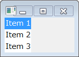
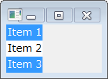

SWT のリストボックス (org.eclipse.swt.widgets.List) を使用するサンプルです。

ひとつの項目だけを選択できるリストボックス (SWT.SINGLE)
----

~~~ java
List list = new List(parent, SWT.SINGLE);
list.add("Item 1");
list.add("Item 2");
list.add("Item 3");
list.pack();
~~~

複数の項目を選択できるリストボックス (SWT.MULTI)
----

~~~ java
List list = new List(parent, SWT.MULTI);
list.add("Item 1");
list.add("Item 2");
list.add("Item 3");
list.pack();
~~~

項目が選択された時のイベントを取得する
----

### Listener を使う方法

~~~ java
// import org.eclipse.swt.SWT;
// import org.eclipse.swt.widgets.Event;
// import org.eclipse.swt.widgets.List;
// import org.eclipse.swt.widgets.Listener;
// final List list = new List(parent, SWT.SINGLE);

list.addListener(SWT.Selection, new Listener () {
    public void handleEvent(Event e) {
        int index = list.getSelectionIndex();
        if (index >= 0) {
            System.out.println(index);
        }
    }
});
~~~

上記の例では、選択中の項目を、

~~~
int List#getSelectionIndex()
~~~

を使用して取得しています。
このメソッドは、項目が選択されていない場合は -1 を返すので、適切なエラー処理を行っておかないと、簡単に境界エラーが発生してしまいます。
List ウィジェットを作成するときのスタイルに、`SWT.MULTI` を指定した場合は、複数の項目を同時に選択できるので、

~~~
int[] List#getSelectionIndices()
~~~

を使用して、選択されている項目のインデックスを配列で取得するようにします。
ひとつも項目が選択されていない場合は、空の配列が返されます。

### SelectionListener を使う方法

List オブジェクトには、Listener インタフェースだけでなく、もう少し具体的な SelectionListener を設定することもできます。

~~~ java
// import org.eclipse.swt.events.SelectionEvent;
// import org.eclipse.swt.events.SelectionListener;
// list.addSelectionListener(new MySelectionListener());

private class MySelectionListener implements SelectionListener {
    @Override
    public void widgetDefaultSelected(SelectionEvent event) {
    }

    @Override
    public void widgetSelected(SelectionEvent event) {
        List list = (List) event.getSource();
        int index = list.getSelectionIndex();
        if (index < 0) {
            // Index will be -1 when no item is selected.
            return;
        }
        System.out.println(index);
    }
}
~~~

SelectionListener インタフェースのすべてのメソッドを実装する必要がない場合は、以下のように SelectionAdapter というアダプタクラスを使うと便利です。

~~~ java
// import org.eclipse.swt.events.SelectionAdapter;
// import org.eclipse.swt.events.SelectionEvent;

private class TitleSelectionListener extends SelectionAdapter {
    @Override
    public void widgetSelected(SelectionEvent event) {
        List list = (List) event.getSource();
        int index = list.getSelectionIndex();
        if (index < 0) {
            // Index will be -1 when no item is selected.
            return;
        }
        System.out.println(index);
    }
}
~~~

JFace の ListViewer クラスについて
----

SWT の List クラスよりも洗練されたクラスとして、JFace の ListViewer クラスが用意されています。
こちらの記事も参考にしてください。

* [JFace の ListViewer を使用する](./jface-list-viewer.html)

