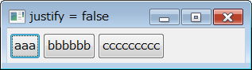

RowLayout で縦／横方向にウィジェットを並べる
----

RowLayout を使うと、ウィジェットを縦方向 (`SWT.VERTICAL`)、あるいは横方向 (`SWT.HORIZONTAL`) に順番に並べていくことができます。

似たようなレイアウトに FillLayout がありますが、RowLayout と FillLayout には次のような違いがあります。

- FillLayout はウィジェットを等間隔に並べるが、RowLayout ではウィジェットはそれぞれ別のサイズで表示される。
- FillLayout はウィジェットをウィンドウ全体を覆うように広げるが、RowLayout ではウィンドウを広げてもウィジェットのサイズは変わらない。
- FillLayout はウィジェットは一列に並ぶが、RowLayout ではウィジェットはウィンドウ端で折り返される。

#### サンプルコード

~~~ java
import org.eclipse.swt.SWT;
import org.eclipse.swt.layout.RowLayout;
import org.eclipse.swt.widgets.Button;
import org.eclipse.swt.widgets.Composite;

public class MyComposite extends Composite {
    MyComposite(Composite parent) {
        super(parent, SWT.NONE);
        getShell().setText("RowLayout(SWT.HORIZONAL)");

        setLayout(new RowLayout(SWT.HORIZONTAL));
        for (int i = 0; i < 10; ++i) {
            Button btn = new Button(this, SWT.None);
            btn.setText("Button " + (i + 1));
        }
    }
}
~~~

RowLayout でウィジェットを同じサイズで表示する
----

RowLayout では、デフォルトでは配置したウィジェットのサイズは異なるものになりますが、`pack` 属性を `false` に設定することで同じサイズで配置することができます（`pack` 属性のデフォルト値は `true` になっています）。

#### サンプルコード

~~~ java
import org.eclipse.swt.SWT;
import org.eclipse.swt.layout.RowLayout;
import org.eclipse.swt.widgets.Button;
import org.eclipse.swt.widgets.Composite;

public class MyComposite extends Composite {
    MyComposite(Composite parent) {
        super(parent, SWT.NONE);
        getShell().setText("pack = false");

        RowLayout layout = new RowLayout(SWT.HORIZONTAL);
        layout.pack = false;  // ウィジェットを同じサイズで表示する
        setLayout(layout);

        Button btn1 = new Button(this, SWT.None);
        btn1.setText("aaa");
        Button btn2 = new Button(this, SWT.None);
        btn2.setText("bbbbbbbbbbbbb");
    }
}
~~~

RowLayout でウィジェット間の余白を等間隔にする
----

RowLayout では、デフォルトでは配置したウィジェットは左、あるいは上方向に詰めて表示されるため、反対側にだけ余白ができます。
この余白を等間隔に分けて配置したい場合は、`justify` 属性を `true` に設定します（`justify` 属性のデフォルトは `false` になっています）。

#### サンプルコード

~~~ java
import org.eclipse.swt.SWT;
import org.eclipse.swt.layout.RowLayout;
import org.eclipse.swt.widgets.Button;
import org.eclipse.swt.widgets.Composite;

public class MyComposite extends Composite {
    MyComposite(Composite parent) {
        super(parent, SWT.NONE);
        getShell().setText("justify = true");

        RowLayout layout = new RowLayout(SWT.HORIZONTAL);
        layout.justify = true;  // 余白を等間隔に配置する
        setLayout(layout);

        Button btn1 = new Button(this, SWT.None);
        btn1.setText("aaa");
        Button btn2 = new Button(this, SWT.None);
        btn2.setText("bbbbbb");
        Button btn3 = new Button(this, SWT.None);
        btn3.setText("ccccccccc");
    }
}
~~~

