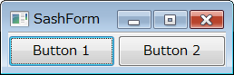
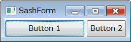

SashForm でウィンドウを分割する
----

SashForm を使うと、ウィンドウを縦方向／横方向に分割し、その分割位置をマウスでドラッグして動かすことができるようになります。

以下のサンプルコードでは、２つのボタンを SashForm を使って横に並べて表示します。
２つのボタンの間の区切り線をドラッグ＆ドロップすることで分割位置を移動することができます。

~~~ java
import org.eclipse.swt.SWT;
import org.eclipse.swt.custom.SashForm;
import org.eclipse.swt.layout.FillLayout;
import org.eclipse.swt.widgets.Button;
import org.eclipse.swt.widgets.Composite;

public class MyComposite extends Composite {
    MyComposite(Composite parent) {
        super(parent, SWT.NONE);
        addComponents();
    }

    private void addComponents() {
        setLayout(new FillLayout(SWT.HORIZONTAL));
        getShell().setText("SashForm");

        // 横に分割して並べるための SashForm を配置
        SashForm sash = new SashForm(this, SWT.HORIZONTAL);

        // SashForm に Widget を配置していく
        Button btn1 = new Button(sash, SWT.NONE);
        btn1.setText("Button 1");
        Button btn2 = new Button(sash, SWT.NONE);
        btn2.setText("Button 2");
    }
}
~~~

SashForm の分割比率を設定する
----

SashForm の `setWeights()` メソッドを使用して、分割位置を指定することができます。
分割位置は `weight` で指定するので、例えば３つウィジェットを配置しているときに、1:2:2 の割合のサイズで分割したい場合は、`new int[]{1, 2, 2}` のように指定します。

~~~ java
// SashForm の分割比率を 1:2:2 に設定
// setWeights は SashForm に Widget を追加してから呼ばなきゃだめ
sash.setWeights(new int[]{1, 2, 2});
~~~

SashForm の仕切りの幅を指定する
----

SashForm による分割線の太さを設定するには下記のようにします。

~~~ java
// 仕切り棒の幅を 10 ピクセルに設定
sash.setSashWidth(10);
~~~

