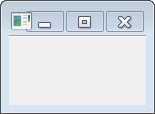

JFace 関連のライブラリ (JAR) にクラスパスを通す
----

SWT と一緒に JFace のライブラリを使用する場合は、swt.jar の他にも以下の JAR ファイルにクラスパスを通す必要があります。

- `org.eclipse.core.commands_<ver>.jar`
- `org.eclipse.equinox.common_<ver>.jar`
- `org.eclipse.jface_<ver>.jar`
- `org.eclipse.osgi_<ver>.jar`
- `org.eclipse.ui.workbench_<ver>.jar`

まずは、上記のファイルを Eclipse の plugin ディレクトリから、対象となるプロジェクトのディレクトリにコピーします。
例えば、lib ディレクトリを作ってその中にいれてしまうのがよいでしょう。

あとは、以下のようにして JAR ファイルをプロジェクトに設定します。

1. Package Explorer でプロジェクトを右クリック => Property
2. Java Build Path の Libraries タブで Add JARs
3. プロジェクトのディレクトリ内の上記 JAR ファイルをすべて選択

JFace で HelloWorld
----

SWT と JFace のクラスパスの設定が済んだら、以下のようなプログラムを作成して、Ctrl + F11 で実行してみましょう。

~~~ java
import org.eclipse.jface.window.ApplicationWindow;
import org.eclipse.swt.widgets.Display;

public class MainWindow extends ApplicationWindow {
    public MainWindow() {
        super(null);
    }

    public static void main(String[] args) {
        MainWindow w = new MainWindow();
        w.setBlockOnOpen(true);
        w.open();
        Display.getCurrent().dispose();
    }
}
~~~

Windows Vista では以下のようなウィンドウが表示されます。

