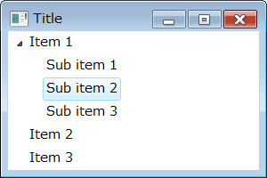

SWT でツリービュー (org.eclipse.swt.widgets.Tree) を使用するサンプルです。

ツリービューの基本
----

SWT でツリービューを構成するには、以下の２つのクラスを使用します。

- `org.eclipse.swt.widgets.Tree`
- `org.eclipse.swt.widgets.TreeItem`

まず、最初に Tree オブジェクトを作成し、Tree オブジェクトを TreeItem のコンストラクタに渡すことで子ノードを追加していきます。
TreeItem にさらに子ノードを追加したい場合は、TreeItem のコンストラクタに親ノードとなる TreeItem オブジェクトを渡します。

~~~ java
//import org.eclipse.swt.SWT;
//import org.eclipse.swt.layout.FillLayout;
//import org.eclipse.swt.widgets.Composite;
//import org.eclipse.swt.widgets.Tree;
//import org.eclipse.swt.widgets.TreeItem;

private static void createComponents(Composite parent) {
    parent.setLayout(new FillLayout());
    Tree tree = new Tree(parent, SWT.SINGLE);

    // 最上位のノードを追加
    TreeItem item1 = new TreeItem(tree, SWT.NONE);
    TreeItem item2 = new TreeItem(tree, SWT.NONE);
    TreeItem item3 = new TreeItem(tree, SWT.NONE);
    item1.setText("Item 1");
    item2.setText("Item 2");
    item3.setText("Item 3");

    // 子ノードを追加
    TreeItem sub1 = new TreeItem(item1, SWT.NONE);
    TreeItem sub2 = new TreeItem(item1, SWT.NONE);
    TreeItem sub3 = new TreeItem(item1, SWT.NONE);
    sub1.setText("Sub item 1");
    sub2.setText("Sub item 2");
    sub3.setText("Sub item 3");
}
~~~

ツリーへの要素の追加方法
----

#### root ノードを追加する

Tree のトップレベルにノードを追加する時は、TreeItem のコンストラクタの第一引数に Table のインスタンスを指定します。

~~~ java
TreeItem rootItem = new TreeItem(tree, SWT.NONE);
rootItem.setText("Item 1");
~~~

#### ノードの下に子ノードを追加

TreeItem の下に子ノードとして TreeItem を追加する時は、TreeItem のコンストラクタの第一引数に親となる TreeItem のインスタンスを指定します。

~~~ java
TreeItem item = new TreeItem(rootItem, SWT.NONE);
item.setText("Item 1-1");
item = new TreeItem(rootItem, SWT.NONE);
item.setText("Item 1-2");
item = new TreeItem(rootItem, SWT.NONE);
item.setText("Item 1-3");
~~~

ツリーノードを選択したときのイベントを処理する
----

Tree オブジェクトに対して、`SWT.Selection` イベント用のハンドラを設定してやることで、ツリーノードを選択したときのイベントを処理することができます。

~~~ java
//import org.eclipse.swt.SWT;
//import org.eclipse.swt.widgets.Event;
//import org.eclipse.swt.widgets.Listener;
//import org.eclipse.swt.widgets.TreeItem;

tree.addListener(SWT.Selection, new Listener() {
    public void handleEvent(Event event) {
        TreeItem item = (TreeItem) event.item;
        System.out.println(item.getText());
    }
});
~~~

より具体的な、SelectionListener を使うこともできます。

~~~ java
//import org.eclipse.swt.events.SelectionEvent;
//import org.eclipse.swt.events.SelectionListener;

tree.addSelectionListener(new SelectionListener() {
    @Override
    public void widgetDefaultSelected(SelectionEvent e) {
        // Do nothing.
    }

    @Override
    public void widgetSelected(SelectionEvent event) {
        TreeItem item = (TreeItem) event.item;
        System.out.println(item.getText());
    }
});
~~~

ツリーノードにデータを関連付ける
----

ツリー内の各要素 (TreeItem) には、`setData()` を使って任意のオブジェクトを関連付けることができます。

~~~ java
TreeItem item = new TreeItem(tree, SWT.SINGLE);
item.setText("Item 1");
item.setData(new MyData());
~~~

上記のように設定したデータを取り出したいときは、`getData()` を使います。

~~~ java
MyData data = (MyData) item.getData();
~~~

データは、String をキーとして分類して設定することもできます。

~~~ java
item.setData("key", new MyData());
MyData data = (MyData) item.getData("key");
~~~

（おまけ）ツリー用の TreeItem のサンプルデータ
----

Tree にサンプルデータを追加したい場合のユーティリティ関数です。

~~~ java
/**
 * Tree にサンプルの TreeItem を追加します．
 *
 * +-- Item 1
 * |    +-- Item 1-1
 * |    |    +-- Item 1-1-1
 * |    |    +-- Item 1-1-2
 * |    +-- Item 1-2
 * |         +-- Item 1-2-1
 * |         +-- Item 1-2-2
 * +-- Item 2
 *      +-- Item 2-1
 *      |    +-- Item 2-1-1
 *      |    +-- Item 2-1-2
 *      +-- Item 2-2
 *           +-- Item 2-2-1
 *           +-- Item 2-2-2
 *
 * @param tree TreeItem を追加する Tree オブジェクト
 */
private void addSampleTreeItems(Tree tree) {
    for (int i = 1; i <= 2; ++i) {
        TreeItem first = new TreeItem(tree, SWT.NONE);
        first.setText("Item " + i);

        for (int j = 1; j <= 2; ++j) {
            TreeItem second = new TreeItem(first, SWT.NONE);
            second.setText(first.getText() + '-' + j);

            for (int k = 1; k <= 2; ++k) {
                TreeItem third = new TreeItem(second, SWT.NONE);
                third.setText(second.getText() + '-' + k);
            }
        }
    }
}
~~~

JFace の TreeViewer クラスについて
----

JFace には、ツリービューを扱うためのより洗練されたクラスとして、TreeViewer クラスが用意されています。
こちらの記事も参考にしてください。

* [JFace の TreeViewer を使用する](./jface-tree-viewer.html)

