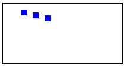

HTML5 Canvas で大きな折れ線グラフなどを描画する場合、グラフ内のマウスドラッグで、描画内容をスクロールできると便利です。
下記のサンプルは、Canvas 上に描画されたオブジェクトを、マウスドラッグで移動させる例です。
描画内容全体を移動させることを考えているため、マウスドラッグを開始する位置は、Canvas のどの位置でも構いません。

#### デモ（Canvas 内でドラッグしてみてください）

<canvas id="my-canvas" width="200" height="100"></canvas>

#### 表示イメージ（上記がうまく表示できない場合のため）

サンプルコードでは、下記のクラスを作成しています。

* **Screen クラス** -- canvas 要素全体の描画を管理
* **Sprite クラス** -- 個々の描画オブジェクト（矩形を描画するだけ）
* **CanvasDragger クラス** -- Canvas 内でのマウスドラッグを検出

#### sample.html

~~~ html

<canvas id="my-canvas" width="200" height="100"></canvas>

~~~

- [drag-object.js（上記から読み込んでいる JavaScript ファイル）](./drag-object.js)

Screen クラスは、`canvas` 要素への描画を管理しています。
`Screen.addSprite()` によって追加された描画オブジェクトを、`Screen.redraw()` ですべて同時に描画します。

~~~ js
function Screen(canvas) {
  this.canvas = canvas;
  this.ctx = canvas.getContext('2d'); // CanvasRenderingContext2D
  this.sprites = [];
}

Screen.prototype.addSprite = function (sprite) {
  this.sprites.push(sprite);
};

Screen.prototype.redraw = function() {
  this.clearScreen();
  for (var i = 0; i < this.sprites.length; ++i) {
    this.sprites[i].draw(this.ctx);
  }
};

Screen.prototype.clearScreen = function () {
  this.ctx.clearRect(0, 0, this.canvas.width, this.canvas.height);
}
~~~

Sprite クラスは個々の描画オブジェクトを表します。
ここでは、単純な矩形を描画するようにしています。

~~~ js
function Sprite(x, y) {
  this.x = x;
  this.y = y;
  this.width = 10;
  this.height = 10;
}

/**
 * Draw this sprite.
 * @param {CanvasRenderingContext2D} ctx - the rendering context
 * @returns {void}
 */
Sprite.prototype.draw = function (ctx) {
  ctx.fillStyle = 'rgb(0,0,255)';
  ctx.fillRect(this.x, this.y, this.width, this.height);
}
~~~

CanvasDragger は、`canvas` 要素内でのマウスドラッグを検出し、`setMoveHandler()` で登録したコールバック関数を呼び出します。

~~~ js
function CanvasDragger(elem) {
  elem.addEventListener('mousedown', this._handleMouseDown.bind(this), false);
  elem.addEventListener('mouseup', this._handleMouseUp.bind(this), false);
  elem.addEventListener('mousemove', this._handleMouseMove.bind(this), false);
  this.elem = elem;
  this.isDragging = false;
}

CanvasDragger.prototype.setMoveHandler = function (callback) {
  this.moveHandler = callback;
};

CanvasDragger.prototype._handleMouseDown = function (e) {
  this.prevX = e.offsetX;
  this.prevY = e.offsetY;
  this.isDragging = true;
};

CanvasDragger.prototype._handleMouseUp = function (e) {
  this.isDragging = false;
};

CanvasDragger.prototype._handleMouseMove = function (e) {
  if (!this.isDragging) {
    return;
  }
  var diffX = e.offsetX - this.prevX;
  var diffY = e.offsetY - this.prevY;
  this.prevX = e.offsetX;
  this.prevY = e.offsetY;
  if (this.moveHandler) {
    this.moveHandler(diffX, diffY);
  }
};
~~~

メイン関数では、Screen オブジェクトを作成し、そこに Sprite オブジェクトを追加していきます。
さらに CanvasDragger によって、canvas 内でのマウスドラッグを検出し、そこですべての Sprite を移動させて再描画しています。

~~~ js
function main() {
  var canvas = document.getElementById('my-canvas');
  var screen = new Screen(canvas);
  var sp1 = new Sprite(30, 10);
  var sp2 = new Sprite(50, 15);
  var sp3 = new Sprite(70, 20);
  screen.addSprite(sp1);
  screen.addSprite(sp2);
  screen.addSprite(sp3);
  screen.redraw();

  new CanvasDragger(canvas).setMoveHandler(function (dx, dy) {
    sp1.x += dx;
    sp1.y += dy;
    sp2.x += dx;
    sp2.y += dy;
    sp3.x += dx;
    sp3.y += dy;
    screen.redraw();
  });
}
~~~

